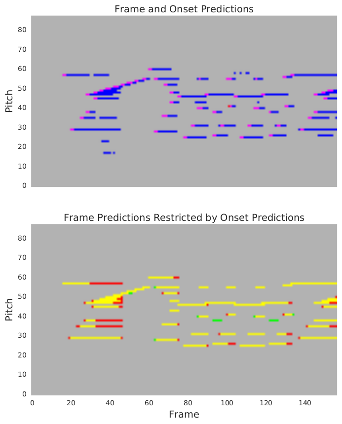
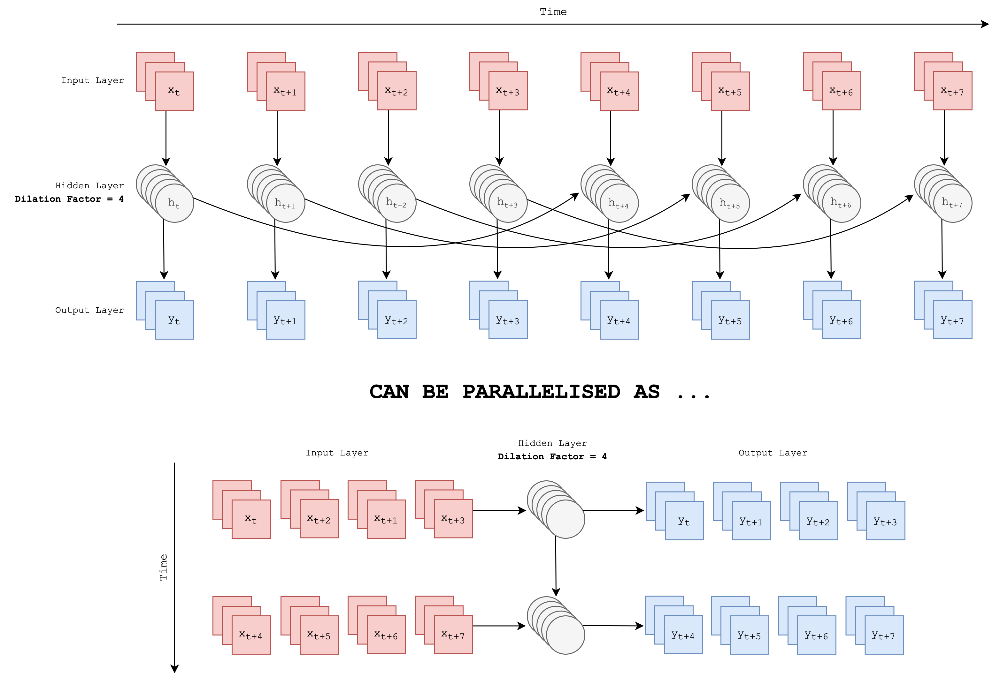
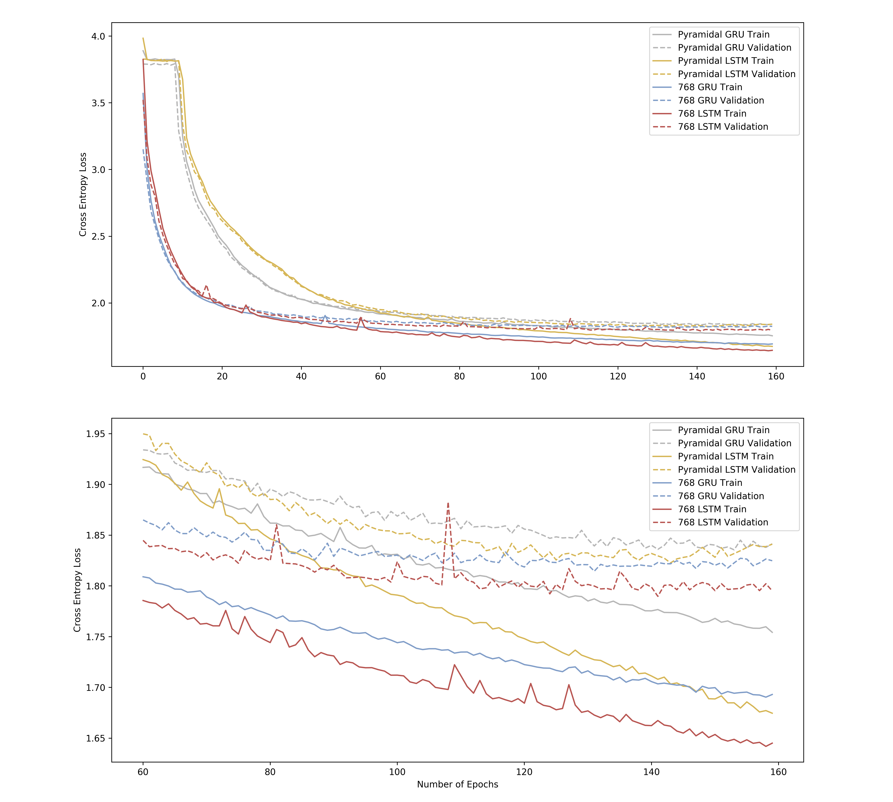
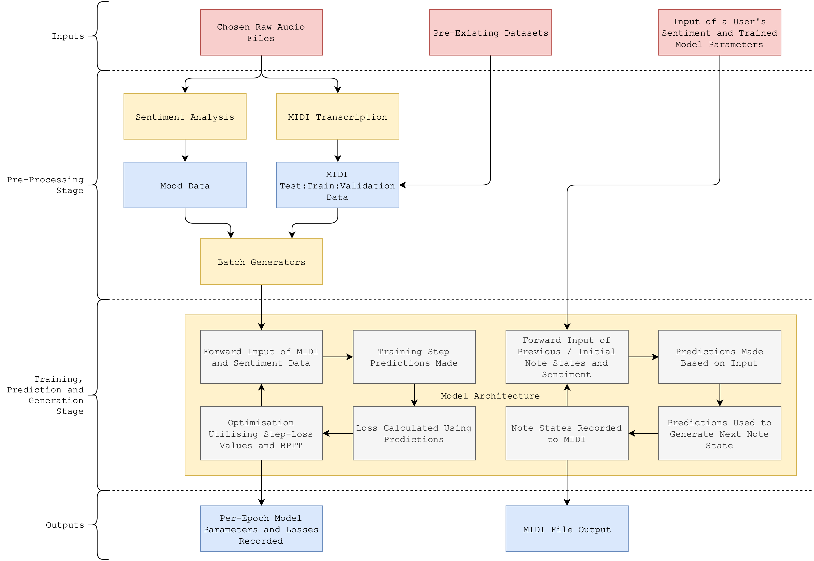

---
output:
  pdf_document:
    includes:
      in_header: init.sty
      before_body: title.sty
    number_sections: true
    toc_depth: 3
    keep_tex: true
bibliography: "Final.bib"
link-citations: yes
csl: ieee.csl
fontsize: 12pt
linkcolor: red
urlcolor: red
keywords: "Recurrent Neural Networks, Machine Learning, Data Science, Probabilistic Sequence Generation, Sentiment Analysis"
---

```{r setup, include=FALSE}
knitr::opts_chunk$set(comment = NA)
lapply(c('rio', 'tibble', 'tidyr', 'dplyr', 'maps', 'kableExtra', 'ggplot2', 'knitr', 'e1071'), require, character.only = TRUE)
```

# Introduction

The project undertaken and discussed in this report was concerned with exploring the problem space of musical composition from a probabilistic and algorithmic perspective, with added extensions regarding the incorporation of a user's mood and some performative characteristics of composition. Numerous approaches exist to offer a basis upon which new ideas and techniques could be applied. These approaches have spanned Markovian techniques, symbolic generative models, evolutionary algorithms, neural networks and beyond. Some of the more historical work has already been surveyed [@nierhaus2009algorithmic]; this report focusses primarily on new developments in the field of deep neural networks and their application and effectiveness regarding musical composition. Justification for this focus is provided throughout the course of the report.

Deep neural network architectures have led to significant improvements in many similar contexts and have already replaced some traditional methods entirely (mainly in the areas of translation, speech recognition and image / video analysis). The importance of this paradigm shift is clear and this project explores the application of some techniques from these other fields to musical composition alongside the deep learning approaches that have already been covered by considering and applying both musical and mathematical theory.

## Motivation

Since recurrent neural networks rose to prominence in the 1990s, deep learning has shown great promise in the task of completely automated algorithmic musical composition. This is a complex application exploring some challenging computational and philosophical questions in terms of how the "rules" of music might be correctly encapsulated in order to compose musical pieces to eventually compete with what has always been an almost exclusively human process. There is still no real solution to this problem despite advances in other creative applications of deep learning meaning there are still a multitude of possibilities to explore and assess.

There would be contention in explicitly defining rules for something as complex and subjective as music; this is where deep learning's relative impartiality and awareness is desirable to potentially understand high-level abstract concepts behind the processes involved in musical composition. Indeed, it has already proven effective on a number of previously inaccessible tasks where patterns were not thought to be present, or at least were difficult to capture due to the perception that some tasks are limited by requirements for human intuition and judgement.

Music appears to be an intrinsically complicated form of data; it is difficult for machines to understand due to the presence of long-term dependencies and complex structures throughout. These structures take on multiple forms but can be roughly categorised into temporal, harmonic and performative structures: a piano player must play in time, in key and also in a way which sounds pleasant through the use of tension, control in their playing style and personal additions of flair.

It is these challenges that form the basis of the motivation for this project. Other researchers have been contributing to this area for decades and this project hopes to further this path of exploration. Moreover, there are great potential implications beyond just musical composition, as recurrent neural networks and deep network architectures are beginning to be applied to a myriad of critical tasks in business, science and society [@deng2014deep; @najafabadi2015deep; @goodfellow2016deep].

Many use cases for the outputs of this project specifically also come to mind, whether it be integration with current digital solutions for the composition of music, or the creation of entirely new services such as procedurally generated soundscapes to match the immersion offered by VR media, or even personal digital assistants which could utilise the work exhibited here to compose or recommend music based on a user's mood.

The complexity of the task and the intrigue its outputs generate from a creative and technical perspective provide a great deal of motivation. It is likely that the innovation required to make progress in musical composition may be applicable to some of the aforementioned tasks where deep learning is already beginning to show promise. Great computational challenges such as these could be compared to similarly ambitious problems in engineering and classical science - such as space travel - which have offered countless by-products integral to modern society.

## A Brief History of Computational Approaches to Composition

The number of research papers regarding musical composition has increased significantly in recent years alongside the increase in popularity of deep learning techniques. However, the task and potential solutions pre-date deep learning entirely:

- Markov chains were first formalised in the 1900s and were used to string together segments of score or individual musical notes based on a set of transition probabilities in order to probabilistically generate sequences of music following initial conditioning. Iannis Xenakis was one of the first to consider this and contributed a lot of discourse regarding Markovian approaches in the early years of the problem [@luque2009stochastic].
- Hidden Markov Models and Recurrent Neural Networks were applied in an attempt to overcome the main limitations of Markov chains regarding their inflexibility and lack of represented understanding beyond the reproduction of sub-sequences of the original pieces that were used to condition them. These techniques first rose to prominence in the 1980s. The early attempts were usually limited by their lack of coherence beyond a small neighbourhood of notes; the outputs would often lack any real structure and explode into chaos or vanish into silence. However, these approaches did start to incorporate the possibility of understanding polyphonic (multiple notes being played at a time, incorporation of chords and polyrhythms etc.) input and generating polyphonic output due to their more complex representations.
- In the early 2000s, some improvements on RNNs which aimed to solve some of the aforementioned issues were first applied to composition. The first published attempt was made by Doug Eck in 2002 [@eck2002finding] and utilised Long Short-Term Memory Units [@gers1999learning] as a potential solution to the flaws associated with RNNs.
- Doug now leads the Magenta team at Google Brain [@magenta] who have created a myriad of models mainly focussing on assisted accompaniment for musicians or improvisation with a user. They have continued to apply LSTMs to these problems as well as variations on the Transformer (a sequence model based on self-attention) pioneered by Huang et al. in 2018 [@huang2018improved].
- The field has fragmented in recent years as teams such as Magenta focus more heavily on interactions with a user, whilst others have started focussing on raw audio rather than MIDI (a universal and compact digital scoring standard for composition) and character representations which are considered to be the standard training data formats. The raw audio approach has huge requirements in terms of data and training time meaning that it is still currently somewhat inaccessible. Despite this, some notable and relatively successful research has been carried out by Google's Deepmind on the WaveNet project [@oord2016wavenet]. Other, less creatively focused applications have started to become popular as well especially within the field of speech synthesis.
- So far there is no documented work on sentiment-influenced automatic musical composition, motivating this project to include it as part of its objectives. There is however a relatively robust body of work surrounding sentiment analysis in images and - more theoretically - in humans.

There is further discussion to this history if the reader is inclined [@mediumkylemcdonald; @libdlmusic]; the list above covers the main and most relevant milestones and aims to provide some historical context to the starting point of this project.

## Research Objectives and Project Requirements

The project was initialised with two main components and associated objectives, these components were:

- The development of a **means of transcription** in order to create training data for a model and the medium around which to build and train the proposed models was to be decided. The main choice in terms of a medium was between raw audio and MIDI data. Other options do exist such as ABC notation (also known as scoring notation, letters representing notes and numbers representing octaves in sequence), but these were quickly discounted due to limitations surrounding the acquisition of training data and also the lack of practical applications for the output when compared to raw audio and MIDI which more richly capture temporal and dynamic structures in music.
- The design and implementation of a model architecture providing **a means of composing polyphonic musical pieces based on training data and sentimental input from a user**; this question is heavily influenced by the answer to the one posed above in that the structure of the training data informs potential architecture choices. Consideration was to be made of all the aforementioned historical approaches, before going on to consider the possibilities of recent innovations in the deep learning field. This component was to be the main focus for technical innovation during this project.

Generative probabilistic models such as hidden Markov models and recurrent neural networks were the main subject of exploration throughout the research section of this project. The main goals may be summarised by the desire to build a versatile model whose outputs are at best indistinguishable from that of a human and at worst impressive in terms of their structural and harmonic coherence. A novel approach was to be built and assessed to determine its place amongst the current cutting-edge systems. Contributions from this report will hopefully form the basis of future research and enable continued development within this problem space. To achieve this, it was first necessary to gain a complete understanding of the current research landscape and formulate comparable and relevant metrics with which to evaluate the project in context of this existing work.

The designed and implemented models draw inspiration from many fields that reveal deep learning as an increasingly effective solution provided high-quality data is present. This inspired investigation into different means of creating and representing training data for the task as well as consideration of the current standards when it comes to datasets used by other researchers.

The requirements placed on the model architecture that will be introduced, formulated and trained as part of this dissertation report are as follows:

- MIDI digital score sourced from existing datasets and transcribed audio should be utilised as training data to condition a neural network's parameters such that it can understand and replicate the structure and dynamics of its inputs.
- Training should be done with respect to some tractable representation of the MIDI data; this representation should encompass:
	- The temporal structure of its training pieces accounting for pauses, changes in tempo and other dynamic intricacies of the input.
	- The harmonic structures present in the training data including the chords, progressions and key of its pieces, by effectively capturing the different notes and combinations of notes present.
	- The dynamics of a piece via the way in which a piano or other instrument is played; i.e. information as to the length and strength with which different notes are played, so that the model might also learn to play with a more human-sounding style by incorporating this information.
- Generated compositions should be influenced by a user's inputted mood or sentiment in some way; meaning the training data must also incorporate some representation of sentiment. Generation should be done using a model post-training and should allow for additional parameters to be supplied by a user such as a starting 'inspirational' state and the length the composed piece should be.
- The model should be independent of any particular genre or pre-training, such that it can be applied to a wide variety of genres and contexts.
- The model should effectively solve or improve upon some of the issues present in current solutions and ideally progress beyond previous work in terms of accessibility and computational requirements by prioritising efficiency and parsimony (minimising complexity and total parameters without sacrificing effectiveness) in a model which is built with an awareness and respect for musical theory without being tied to it.

Additionally, in order to facilitate the above main requirements, a means of audio to MIDI transcription must be proposed and implemented that is effective and accessible such that others might replicate this work or potentially package it into a user-friendly solution for anyone to interact with and make use of the technical innovations described here. This transcription system should produce outputs of the highest possible accuracy so that it can be used to generate training data of the highest possible quality (involving minimal noise and incorrect notes which would potentially damage a model's capacity to learn effectively).

Some stretch goals were highlighted early in the project's specification but were ultimately not included due to their lack of contribution to the aforementioned goals and in the interest of wanting to focus on building the best model architecture and representation possible. The main stretch goals were:

- A website hosting a pre-trained model to allow for interactivity for non-expert users and to potentially facilitate a larger scale qualitative assessment of the project using feedback from interactions with this web application.
- Utilising existing solutions in image analysis (an area which is considerably more developed than this one) to analyse the sentiment of an image and then feed this sentiment in as input rather than having the user input it manually.

These objectives required significant background and technical knowledge to be gathered as well as a rigorous development process, both of these are discussed in the [Methodology section](#methodology). The decisions made throughout were often reliant on context provided by the historical timeline of the problem and the accrued body of related work relevant to this problem space.

# Related Work

The methods and solutions described here tend to be linked but are discussed with respect to the two main components mentioned previously.

## Musical Data, Transcription and Representation

### Justification for Using MIDI Over Raw Audio

The main goal regarding transcription and representation was to build a large library of data with enough engineered features for the model to successfully produce meaningful output. As was already alluded to, it becomes clear following initial investigation that the use of raw audio data involves a much larger computational overhead making it an infeasible approach given the time-scale and resource allocation of this project (as well as the fact that often projects in this space feature multiple postgraduate authors). MIDI as a format is a standard in the world of digital musical equipment and production as well as in research surrounding this problem (the majority of the papers cited here utilise MIDI to some extent); its equivalence with musical score and provision of deterministic data on what notes are played, when they are played and how they are played lends itself perfectly as a format to the task of training a model to compose music.

These characteristics are clear and separable such that there is no confounding information regarding the music contained; a model can learn the "rules" of music through considering the same things a human would consider when composing a piece. Raw audio includes many artefacts and intricacies which obscure these features as well as being potentially too complex for much of the current landscape of machine learning, especially when compared to representations such as MIDI [@dai2018music].

Raw audio contains data regarding the timbres of different instruments, performance characteristics etc. which are incredibly difficult for current technologies to comprehend; MIDI provides an excellent middle ground especially with the inclusion of velocity data which still captures some of the human performative elements of a piece in a quantitatively justifiable way. Structurally, it is much easier to model music using this compositional data which is abstracted away from the factors such as the instrument it is played on and a player's personal style.

The only documented attempt of working with raw audio that showed any potential for success was carried out by Google [@oord2016wavenet] who are significantly advantaged in terms of their resources.

### MIDI Transcription Techniques

Google's work can still be leveraged however: their Magenta team have created a TensorFlow sub-package focussing on musical composition, transcription and other artistic endeavours. This work includes an "Onset Frames" model for MIDI transcription [@hawthorne2017onsets] that is pre-trained on classical piano music and has performance beyond all other options in terms of F1-score and accuracy. Its architecture mainly relies on convolutional kernels to capture features in the raw audio and map them to MIDI notes. Due to this, it requires a great deal of training data to be effective and tends to perform best in transcribing the genre it was trained on, though it is still reasonably effective for other styles of musical input. Many other attempts have applied convolutional neural networks to the task of musical transcription [@bereketai; @sigtia2016end; @sarnatskyi2017music] with promising results at their resolutions indicating that this application of CNNs is likely the current standard in musical transcription. 

It is worth noting that this process exemplifies one of the largest challenges and complexities in this project: using machine learning to *generate* the data used to then train a model to compose music in a similar way introduces a lot of uncertainty and dependence between these two components. Any issues with this first component would propagate throughout the entire project, meaning that it was important to assess the model's quantitative performance using comparable methodology and pre-existing datasets, on top of fulfilling the goals of the project qualitatively by building an end-to-end system incorporating the creation of training data from raw audio as described.

Other approaches to transcription pre-date the use of CNNs and focus on more traditional signal processing techniques. Of these, WaoN [@waon] appeared to be the most accurate and well-documented. Cross-validation and assessment between the "Onset Frames" model and WaoN was carried out; often one was better than another depending on the structure and content of the raw audio source.

### Pre-Existing Datasets

Some pre-existing datasets were also investigated and utilised in training and evaluating the models to provide an alternative to the training data generated using the techniques discussed above and hopefully mitigate some of the concerns and uncertainties raised in using non-perfect data to train a model. Of these, the most notable are the MAESTRO dataset [@maestro2018] which includes over 1200 pieces in MIDI and `.wav` format spanning 170 hours, alongside the four datasets which appear to be the current standard in evaluating models in other musical composition research papers. These are:

- JSB Chorales, a corpus comprised of 382 four-part chorales by Bach and recorded to MIDI by John Sankey on a Digital Piano
- MuseData, a library of 784 orchestral and classical pieces spanning numerous composers recorded as MIDI data, compiled through sponsorship from the CCARH at Stanford University [@ccarh]
- Nottingham, a corpus of 1038 folk tunes transcribed to MIDI
- Piano-Midi.de, a collection of 125 classical piano piece MIDI transcriptions

All of these datasets are hosted online with their original test:train:validation splits included, hosting is provided by the University of Montreal where Boulanger-Lewandowski et al. carried out their research and evaluation into automated musical composition [@boulanger2012modeling]. Their evaluation procedure has since been replicated in numerous works, inviting its inclusion in this project as a means of measuring the progress made in relation to previous attempts. Additionally, the availability and utilisation of these datasets was integral to beginning development on the model architectures in a timely manner without having to rely on a completely realised MIDI transcription solution.

### Possible Representations

Almost all of the cited papers involve a variety of unique approaches to representing MIDI or audio data numerically in a format that captures the relevant features to facilitate acceptable training of a model. Most utilised some form of one-hot binary mapping to the keys on a piano, or used symbolic text processing approaches which generated strings of notes based on the classical lettered notation of music (A1, B2, C4 etc. with the number indicating which octave on the piano each note belongs to).

## Competitive Existing Solutions

### Neural Network Approaches

Neural Networks are undoubtedly a very active area of research; a lot of which is relevant or could even be directly applied to this project. For example, "How we Made Music Using Neural Networks" [@alextavgen] references an article by Andrej Karpathy (Tesla's Director of AI); both of these pieces together formulate a good introduction to the technologies to be implemented for a large portion of this project. The Karpathy article [@karpathy] showcases some of the capabilities of Recurrent Neural Networks working on generating code, text and images. Music is considered to be a more challenging feat for these systems, which is perhaps intuitive given its continuous and often complex nature. The former of the two articles discusses a short exploration into this challenge, a challenge which this project will go further in trying to tackle.

Google's Magenta project was mentioned as one of the main leads for composition. Magenta's collection of pre-trained models is testament to the promise of this platform; more specifically there are pre-trained models available which produce improvisation, polyphony and interpolation of input pieces [@magentaimprov; @magentavae; @magentapolyphony]. The aim of this project is to build and train a model sitting somewhere between these existing ones, one which is capable of generating inspired sequences of chords and notes and then recurrently feeding these generations back into itself in order to emulate the process of composition. 

Beyond Magenta's work, there exists numerous other approaches within this space. CNNs and GANs have also been incorporated into convolutional models and applied to the problem [@yang2017midinet] with success comparable to that of some RNN-based approaches. Some very promising work was carried out in studies on music generation from MIDI datasets [@hilschermusic; @wyse2018real] which shows the potential of RNNs for this task. A similar project called DeepJazz [@kim2016deepjazz] was produced in a hackathon in a matter of hours and also gave very promising results, again using an RNN.

A lot of discourse exists on how much a model should be constricted in terms of its prior knowledge or training. One successful attempt utilised LSTMs [@gers1999learning] to first predict a chord progression based on some prior embedding and then utilise this to compose a full piece [@brunner2017jambot]. The learned chord embeddings closely emulated musical theory conventions when assessed indicating the model did successfully learn to replicate the human process of constructing harmonic chords.

Other approaches elect to begin with almost no prior assumptions of musical theory injected into the architecture in the hope that the model will formulate them for itself or at least discover some abstract rules present in the music which lead it to produce pleasing outputs [@kotecha2018generating; @colombo2018bachprop; @boulanger2012modeling]. It is again common to witness LSTMs being used in these approaches and many of them incorporate the ability to learn and consider other features of music such as its genre or style. These additions are part of what formed the basis of the inspiration to incorporate sentimental input into the work carried out during this project. 

The use of recurrent neural networks is clearly prevalent and often results in better performance than other techniques. This led to the investigation of literature beyond just musical composition with respect to the theory and possible improvements to be made on RNNs in general. Much of this discussion surrounds the alleviation of issues regarding their training and capability to understand. The most popular solutions or improvements with respect to these issues were found to be LSTMs and more recently developed GRUs [@cho2014learning] which have not been applied as extensively to musical composition but appear similar in formulation. 

After carrying out this research into different neural network-based opportunities, it was decided that a recurrent neural network utilising some version of an LSTM or similar variant recurrent unit would be the most appropriate implementation for this task due to the allowance for different lengths of input and output compared to something like a convolutional neural network which has fixed input and output dimensions.

### Other Approaches

Many early systems for automatic composition are rule-based and symbolic. They range from methods which require for the manual specification of rules [@ebciouglu1988expert; @cruz1998learning] to ones which can derive their own through the analysis of pre-existing data [@cope1996experiments; @spangler1998bach]. They form a promising basis for much of the work that has occurred since, in that rules were successfully extracted from musical data, and could even be categorised into rules for different genres and styles of music. These early successes have inspired and justified much of the work in attempting to develop a deeper understanding of the semantics behind musical composition. However, these particular methods are limited by reliance on the rules they are assigned or derive for themselves; they are restricted to certain narrow applications and do not generalise well beyond these applications.

One of the most impressive symbolic representational approaches was undertaken by Sturm et al. [@sturm2018let] in producing a full album with trained musicians and having it reviewed without revealing the nature of its composition. This is a very effective but resource intensive means of qualitative assessment as well as an effective example of a Turing Test for computational composition tasks. This method was more based in deep learning than traditional rule-based approaches.

Markovian models [@luque2009stochastic] are the basis of another popular approach which has been somewhat overshadowed by deep learning in recent years. State spaces allow for the sequential generation of new MIDI built from probabilistic sequences of notes. The familiarity held by the author with stochastic processes and Markov chains meant this approach lent itself as an inviting first step to the implementation of some of the initial research comprising this project. Markovian models could be implemented and conditioned with training data to provide a system which could improvise through traversing state spaces of encountered notes using associated transition probabilities.

The ease of this approach also summarises its main disadvantage: there is a noticeable lack of complexity and novelty in the pieces composed. By its nature, most of the states which the algorithm can traverse are directly influenced by the input data and thus often lead to sections which are identical to one of the inputs. This could be attributed to a lack of training data, though using more led to increasingly small transition probabilities and a descent into near randomness, losing a lot of the musicality present in previous outputs along the way. These initial conclusions led to the focus shifting entirely onto the interpolation and creation of neural network approaches to compete with those already discussed.

## Articles of Interest in the Field

The discourse provided by Magenta's blog and development path alongside that found in articles on the internet [@mediumkylemcdonald; @mkofler] helped influence the decision to pursue more complex neural network based approaches to composition. Both of these cite Markovian techniques as a *starting point* for this area; something which has quite safely been surpassed in every respect at present. An article discussing comparisons of various deep learning tools for music generation [@asimovinst] was also informative, highlighting Magenta as a tool of great promise.

# Methodology

<!-- 
The point is to demonstrate the work was well-planned
• you thought how to approach the work
• you assessed alternatives and the current way was best
• your approach helped you conduct your project in a structured way

To provide a sound basis for any results/conclusions
• Eg: a sample can be justified as representative; the statistical techniques applied to data analysis were appropriate...
• So that others can trust your outcomes/findings
PROJECT DEVELOPMENT this is more about the questions posed and how the project crystallised over time.

-->
## Project Management

In order to impose a structure of project management, meetings with the project's supervisor were organised roughly once per week; these meetings offered a chance for discussion of ideas and the receipt of advice and aid in resolving some of the issues faced throughout the course of the project. 

<!-- With most of the preliminary and supporting research complete, as well as the main few directional questions answered, development may continue in earnest. Below is an updated Gantt chart to show how the project's trajectory and schedule has changed since the initial specification, as well as showing confirmation of the completion of some of the defined tasks. There are some slight changes following the issues or decisions discussed earlier in the document, but for the most part the schedule remains unchanged. -->

### Research Methodology

The first stages of this project in particular had stringent research requirements in order to formulate an effective approach. There was a large body of work to investigate, much of which consisted of research from the past couple of years meaning much of it was still somewhat theoretical or lacking in pre-existing implementation options. This imposed a requirement for careful thought in terms of which avenues might be worth exploring and which were feasible with the given resources and time-frame. This research was well-documented in the submissions prior to this and crystallised throughout this final report. It was critical to maintain a review of all of the encountered research in order to build the best possible solution bringing together elements from many of the current state-of-the-art approaches.

Due to the scale of the task taken on and the associated technical requirements, it was decided that first formulating some research questions would be the best approach. These questions equate with the components mentioned in the [introduction](#introduction); decisions were to be made regarding the format and representation of musical data as well as regarding the type of model to build. These questions could only be answered once sufficient background knowledge was gained but were clearly critical to the project's progression. This research provides justification and context to many of the decisions exhibited in this report and was continually referred to whilst formulating a technical approach to the problem.

Due to the nature of deep learning models, it would also have been difficult to properly evaluate the models without this basis of prior knowledge. Many alternatives were investigated and filtered out during the development process in order to converge upon the technical content discussed later in the report. It was also necessary to first gain a theoretical understanding of many of the components which are based in theory beyond the scope of an undergraduate course. This understanding allowed for effective creation of solutions and experiments within the problem space, whilst considering the available resources and expertise by gauging the possibility of implementing and exploring different options.

### Development Methodology

<!--
Eg: (how) did your approach incorporate reqs analysis, design, modularity, incremental testing, reuse, scalability
(how) did you incorporate the results of user evaluation?
-->

Previous development experience alongside agile methodologies contributed to an effort to accommodate for a flexible, research-driven development process. Building complex models such as the ones discussed here meant that experimentation was necessary; not only with hyper-parameter tuning but also amongst a group of potential architecture choices. This was accentuated by the black-box nature of complex models with thousands of parameters. Additionally, musical composition clearly does not have a fixed optimal solution implying that the development process would have to allow for changing requirements and information as trials took place. The model architectures are evaluated relatively to each other and previous work meaning that there is a focus on improvement with respect to model accuracy, the quality of outputs and the computational implications rather than reaching some pre-determined threshold.

The specification and progress report documents were important in providing a strong foundation in order for development to begin. An iterative approach was taken to development starting with a rush in Term 1 to an MVP emulating techniques seen in the current literature surrounding the problem, and adhering to the initial decisions and requirements outlined in this preliminary documentation. This provided a tactile means with which to gauge the feasibility of the project from an engineering perspective at the earliest possible time; it was important to remain open and re-evaluate the requirements of the project after this first development phase due to how foreign much of the content was.

Modulation of code was made possible due to the nature of the project's components; it was important to refer back to the common goals of the project when building a system for MIDI transcription and representation to ensure that it would eventually communicate correctly as part of a pipeline feeding training data into the model. This modularity allowed for development to continue on one part of the project if another part had raised an issue, until a solution to the problem was found through further research or a meeting was arranged with the project's supervisor. Files were separated by function and could be executed separately to allow for unit testing and functional testing to take place with respect to the aforementioned requirements.

The code was mainly written in Python and utilised PyTorch due to its dynamic graphs and efficient execution of neural network models. Theano was initially used to build the MVP due to previous familiarity with the platform. However, PyTorch allowed for more efficient parallelisation and utilisation of the GPU as well as a more robust testing process to take place throughout execution of a dynamic graph when compared with the static graphs of TensorFlow and Theano. PyTorch also allowed for the generation of real-time training statistics which promoted a more streamlined development process as models could easily be assessed and reflected upon without waiting for them to finish training. It was important to use a scalable solution that would work on both CPU (such that the author's laptop could be used to run and train the model if required) but also run in the shortest time for full training cycles on the servers provided by the University [@warwickcomputenodes].

## Ethical Considerations

There are no major ethical considerations regarding this project. All of the potential issues are briefly discussed here. 

All citations have been checked and are included where necessary to ensure credit is given where existing work has been reused or had a significant influence on the course of the project. The code used for sentiment analysis was based upon the DeepSent project as already mentioned which is present on GitHub under an open source Apache 2.0 license via its creator Mu Chen. The rest of the code included in the technical appendix is referenced where appropriate or entirely original.

A small survey was devised and carried out in order to test a subject's ability to differentiate between human-composed pieces and those generated by the compositional engine. This survey was carried out with willing participants over the internet by sending them a mix of unmarked audio files all synthesised using the same virtual piano. The user is simply asked to categorise them into two folders separating human and non-human compositions before sending them back. This ensures the study was unbiased and also offered the chance to ask for feedback as to the quality of the pieces once a participant had carried out the first task. The results were recorded over a period of 2 weeks and are presented in the evaluation section.

This survey was discussed with the project's supervisor but was deemed to be satisfactory in terms of any ethical considerations; no further justification or recourse was necessary to ensure the ethicacy of it as a means of evaluation.

IS THIS OK?

# MIDI Transcription

MIDI is a digital musical scoring format considered to be the universal standard for communication between instruments and within software. MIDI files carry data concerning the tempo, length and other details of a song as well as a sequence of events relating to when different notes are played and *how* they were played via their associated **velocity** (representing the force with which a key is pressed, and the resulting modulation on a note's volume and intensity). Other features may be recorded as MIDI such as changing parameters on a synthesiser or interactions with a digital piano's sustain pedal but these are not utilised here as they are often too subjective to inform of compositional style, they are more artefacts of performance, or there is not enough training data with these features present to warrant including them in a training data representation. MIDI can be recorded using digital instruments in real time and a file exported from software, or it can be transcribed from raw audio. The transcription of MIDI is an on-going task as described in the [Related Work](#relatedwork) section.

For this project, it was decided that to empower a user with the ability to create a training dataset from their own music library was a compelling goal. In order to achieve this, multiple solutions for MIDI transcription were considered and evaluated using a number of different factors. Some preliminary testing was done by first designing a sequence of MIDI notes which could then be played internally and exported as an audio file. These MIDI notes acted as a ground truth. Within these test files, chords and complex structures were included as well as different levels of applied white noise. From here different techniques could be tried in order to decide which would be best:

- WaoN [@waon] is a transcription tool which converts `.wav` audio files to `.midi` files. It carries out frequency-domain analysis using Fast Fourier Transforms which are computationally intensive but are flexible and accurate when compared to simpler autocorrelational techniques [@klapuri2004automatic; @gerhard2003pitch] meaning they are often applied to more complex tasks such as pulling out polyphonic features in music as was the goal of this part of the project. This technique requires no training data and so can be quickly applied to a large array of audio; it is not restricted to a specific genre according to its creator and even has the means to try and remove drum sounds when transcribing.
- Magenta's "Onset Frames" model [@hawthorne2017onsets] is considered cutting-edge and utilises a convolutional recurrent neural network architecture to predict pitch events both in a frame-wise and onset context. I.e. it first predicts where notes may begin and then uses these predictions to influence predicted frames where a certain pitch is present. Where these predictions are in agreement (an onset is predicted for that pitch within the predicted pitch frame) a note is presumed to be present and can be transcribed to MIDI. Training data and scope again rears its head as an issue with this approach, as is mentioned in the referenced paper.

{width=60%}

In the first image, blue indicates frame prediction, red indicates onset prediction, and magenta indicates frame and onset prediction overlap. There are several cases where the frame detector thinks there is a note and the onset detector does not (notes that do not have a magenta block at the beginning). Most of those frame detections are incorrect, which illustrates the importance of removing notes that do not have a detected onset. The second image shows the predictions after removing notes that did not have a detected onset. Yellow indicates frame prediction and ground truth overlap, green indicates an erroneous frame prediction, and red indicates ground truth without a frame prediction (\textit{image description also sourced from Magenta's Blog}).

Based on the transcriptions both create it is possible to compare them qualitatively. Magenta’s approach is decisive in its choice of notes and often more confident when it comes to timing due to its training instilling a greater sense of tempo and structure in its transcriptions. WaoN is sensitive and picks out many intricacies of a songs dynamic range, but this often leads to the incorporation of more false positives in terms of ghost notes (notes that should not be present but are determined to be through frequency clashes, overtones etc.).

Both seemed to be viable and offered slightly different versions of the training data to be used in training the compositional models, and as both were viable it was decided that both should be used. Magenta's model shows great promise and it is likely that with the correct training data this approach would be far superior to WaoN in fixed domain transcriptions (i.e. training the model on a dataset of ground truth transcriptions of a certain genre before using it to transcribe more of that genre, so that it might understand the 'rules' of transcribing genres other than classical more effectively). I have no doubt that in the next few years applications such as WaoN will be largely eschewed in favour of modern machine learning approaches similar to what has happened to the field of Computer Vision over the past decade or so.

WaoN has numerous tuning parameters. The most regularly used were:

- `-n` for changing the sampling window from the input file, higher number results in fewer samples, as `-n` corresponds to the number of samples in a single step to be analysed.
- `-c` allows the user to set the base-10 logarithm of the cut-off ratio upon which velocity of a note should be scaled, i.e. lowering its value allows for weaker notes to be captured.
- `-r` does the same but relative to the average velocity, this can be used to remove noisy notes from the outputted MIDI.

It was found that decreasing `-c` from its default and increasing `-r` along with a relatively large sampling window `-n` gave the best results with the fewest noisy notes and came closest to emulating the original pieces. These outputs still often included many more ghost notes than Magenta's outputs, but sometimes captured complex structures that Magenta did not, contributing to the final decision to use both approaches in tandem.

## Gathering a Training Corpus

WaoN and Magenta's Onset Frames model were used to convert a personal library of ambient music containing approximately 1,400 pieces spanning 180 hours into MIDI.

The model was also trained on classical music to make it more comparable to existing offerings, and to reduce some of the issues regarding noisy training data that creating an original corpus presented. The MAESTRO dataset [@maestro2018] was used which is potentially the largest of its kind, providing 1,200 pieces spanning 170 hours in `.wav` format alongside their ground truth MIDI files (the audio and MIDI were recorded together using an electronic piano and microphones, so no MIDI transcription took place like the processes described above, MAESTRO describes the "perfect" training set for this kind of model). The raw audio could be used to analyse mood which could then be associated with the MIDI files as before.

For the later evaluation with previous work, the four datasets JSB Chorales, MuseData, Nottingham and Piano-Midi.de were also used as discussed previously. These datasets did not include raw audio meaning mood data was not able to be extracted from them; this was not an issue as in order to remain relevant the sentiment part of each model's architecture was effectively cut out when these datasets were used to ensure the loss function values were comparable to previous attempts.

## Building an Effective Representation

After deciding on the raw training data to use, a schema was required to represent the selected MIDI files in a tensor format so that they could be used to train the model. MIDI was converted to tensors by iterating through their files using the python package `mido` [@mido]. It is useful to consider the format of a MIDI file in that they are a stream of messages containing:

- A message class, usually a `Note On` or `Note Off` event, but could also be `End of Track`, `Set Tempo` etc.
- An affected note where applicable, in the range of 0 to 127, this is the standard range of MIDI as a format and represents around 10 octaves on a piano.
- A velocity associated with `Note On` events, ranging from 0 to 127.
- A tick value corresponding to the number of MIDI ticks that have passed since the *previous* event.

Most existing solutions do *not* have an effective means of representing velocity in their training data. This was considered to be an important factor when designing a representation, as much of what makes music sound human comes from the dynamics velocity can contribute to a piece. Recent work by the Magenta team proposes one method of incorporating velocity [@performance-rnn-2017], but their research paper is still forthcoming, leading to the formulation of the slightly different method described below.

`mido` is used to iterate through MIDI events in order to generate a sequence of numbers representing a MIDI file. In the resulting sequence, the values 0 to 127 are reserved for notes, 128 to 159 are reserved for time and 160 to 192 are reserved for velocity. Time and velocity are packed into bins for performance reasons rather than trying to attempt to represent all possible times and velocity levels; 32 bins were deemed to be sufficient. A new number is appended to the sequence first for the time when an event occurs, then for the velocity of said event if it concerns a played note, and finally the note value itself is added. If a time exceeds the length of time represented by the $32^{nd}$ time bin, additional numbers are appended to the sequence representing the remaining time.

A MIDI file containing the following events would be converted as below:

$$\begin{gathered}
\text{(Note On Event, Note = 55, Velocity = 90, Tick = 831)} \\
\text{(Note On Event, Note = 67, Velocity = 85, Tick = 3)}\\
\cdots\\
\text{Becomes : } [159, 182, 55, 181, 67, \dots]
\end{gathered}$$

Note that a tick value of 3 is not sufficient to warrant the inclusion of another time-bucketed event meaning that there is no 'gap' between the playing of notes 55 and 67 in this representation. Ticks can be converted to some number of milliseconds meaning that these small changes in time resolution through binning are imperceptible to us as listeners. It was relatively simple to test the efficacy of this representation by converting from MIDI and back and then comparing the input and output MIDI files.

Once the training data is in this form it is randomly sampled into equal length sequences for training purposes. The resulting array representations are one hot encoded to turn them into two-dimensional tensors before being fed into the model in batches. This leads to each element of an input sequence having the dimension:

$$\begin{aligned}
D_{\text{input}} &= \text{Number of Possible MIDI Notes} + \text{Buckets for time} + \text{Buckets for Velocity}\\
&= 128 + 32 + 32\\
&= 192
\end{aligned}$$

The above corresponds to the dimension of a single event vector in a training sequence. In practice, the three-dimensional tensors created through batching and random sampling of training data have the following dimension:

$$\text{Batch Size} \times \text{Training Sequence Length} \times D_{\text{input}}$$

A mood vector is inputted separately and eventually merged with the training sequences by the model using a linear unsqueeze operation to distribute it across the first layer.

# Sentiment Analysis

In order to satisfy the requirements of the project regarding sentiment, it was necessary to first extract the sentiment from each component of the training data corpus and then formulate a means of attaching this sentiment to the representation of the training data to be fed into the model during training.

Much of the technical work regarding extraction of sentiment from audio follows the work done by Mu Chen and their DeepSent project [@deepsent]. This code was used as a basis upon which a vector of mood values could be generated automatically for each element of the chosen datasets and then associated with the MIDI files to be used in training. Sentiment is measured with respect to an arousal-valence emotional model known as the Circumplex model [@russell1980circumplex], with values being determined for both axes of arousal and valence.


In this context, arousal refers to the perceived intensity of a piece; ranging from a relaxed or somewhat lethargic feeling to a more intense and excited stimulation. Valence is a spectrum of a piece's incited effect on a listener's level of happiness or sadness. This model was chosen as it captured much of the emotional impact of music in a parsimonious way; trying to apply higher dimensional models of emotion tended to lead to less meaningful predictions by the models. Values for both axes were estimated and ratios calculated to fulfil three ratio values regarding each axis. The ratios are calculated as shown below following predictions made by the models:

$$\begin{aligned}
S_A &= \{\text{Scores assigned to each input by the arousal regressor model}\} \\
\text{Arousal Intense Ratio } &= \frac{\sum_{S_A} \mathbbm{1}_{\text{Score}> 2}}{|S_A|} \\
\text{Arousal Relaxing Ratio } &= \frac{\sum_{S_A} \mathbbm{1}_{\text{Score}< 1}}{|S_A|} \\
\text{Arousal Mid Ratio } &= 1 - (\text{Arousal Intense Ratio} + \text{Arousal Relaxing Ratio}) \\ \\
S_V &= \{\text{Scores assigned to each input by the valence regressor model}\} \\
\text{Valence Happy Ratio } &= \frac{\sum_{S_V} \mathbbm{1}_{\text{Score}> 2}}{|S_V|} \\
\text{Valence Sad Ratio } &= \frac{\sum_{S_V} \mathbbm{1}_{\text{Score}< 1}}{|S_V|} \\
\text{Valence Neutral Ratio } &= 1 - (\text{Valence Happy Ratio} + \text{Valence Sad Ratio}) \\
\end{aligned}$$

In both cases it can be seen that ratios are calculated through taking the top and bottom few scores and calculating the ratio of each above and below boundaries which were formulated through testing and with respect to the original work. It is worth noting that all scores fall between a range of 0 and around 5, but extreme values are clipped to 3 as they are often spurious.

IS THIS SUFFICIENT TO ADDRESS THE LACK OF CLARITY SURROUNDING SENTIMENT ANALYSIS MENTIONED IN THE PRESENTATION FEEDBACK?

## Implementing Signal Processing Techniques and Returning the Results in a Usable Form

Each piece to be analysed is trimmed of its start and end (which are likely to be sparse and potentially irregular in terms of their content when compared to the main body of a piece occurring around its midpoint) to leave the middle 70% of the data. This raw data is then windowed into 5-second long frames of samples, with a step of 0.5 seconds between the starting points of each (such that there is overlap between frames). Within each of these there is then a further decomposition into 25ms sub-frames that are transformed into an array of Mel-frequency cepstral coefficients (MFCCs). The matrices representing the MFCCs for each sub-frame are then flattened and fed into a 3-layer neural network regressor. The neural networks associate patterns common within certain moods based upon what was learnt from numerous large datasets used for training these models.

These ratios are then packed into a six-item vector and associated with each of the training MIDI files to be loaded during training. Thresholding as a means of segmentation was implemented by setting all ratios greater than 50 to 1 and those below 50 to 0. This offered computational improvements but potentially slightly decreased the effectiveness of the mood transfer to training pieces. Due to the subjectivity of this part of the output, it was hard to assess which approach was more effective in capturing mood and so the simpler, less computationally intense thresholding option was chosen. This resulted in a six-element *binary* vector representing mood associated with each item in the training corpus.

# Creating a Recurrent Model for Musical Composition

## Recurrent Neural Networks

Perhaps the most common form of artificial neural network is the *feedforward* network which utilises connected layers of neurons and activation functions to approximate different functions through the learning of parameters and weights. Their main limitations in this context are that they require their inputs to be of a fixed dimension and thus are not well suited to dynamic data of varying size such as a sequence $(x_t)_{1\le t\le T}$ of time stepped note states representing a composition where $T$ is the length of the piece.

It is assumed that this type of sequential data has some system of dependence on its prior and potentially future elements and so it would not be appropriate to assume independence and simply input each element of a temporal sequence into a feedforward network during training. It can clearly be seen by observing musical data and considering knowledge of musical theory that the input at each time step is likely to be dependent on other time steps (compositions have an associated and consistent *key* which may be inferred by chords and notes present throughout the piece).

This class of situations led to the development of **recurrent neural networks** which introduce recurrent connections between layers over a temporal dimension allowing the network to exhibit dynamic behaviour over time. Their evolution over time depends on the inputs as well as its previous / current state. They could be considered to be an evolution of Hidden Markov Models [@baum1966] but with the addition of a distributed state allowing for more complex and dynamic behaviours to be captured in a computationally effective manner.

It is now possible to provide some notation specific to this project regarding RNNs. A training input is defined [as before](#buildinganeffectiverepresentation), with the vector corresponding to the sequence at time $t$ denoted as $x_t\in \{0,1\}^{D_{\text{input}}}$. At each time step, a layer's input $x_t$ and its previous state $h_{t-1}$ are used to calculate a new value $h_t$ for each hidden layer $h\in\{\text{Hidden Layers}\}$ and also inform the outputs for that time step $y_t$. Mathematically, this relationship is as follows:

$$\begin{aligned}
h_t &= \phi(W_{xh} x_t + W_{hh} h_{t-1} + b_{xh}) \\
y_t &= W_{hy}(h_t) + b_{hy}
\end{aligned}$$

Where:

- $\phi$ is the chosen element-wise activation function for the network.
- $W_{xy}$ represents the weight parameters between layers $x$ and $y$, these weight parameters are learned using backpropagation through time [@werbos1990backpropagation].
- $b_{xy}$ is the bias parameter between layers $x$ and $y$.

In this case and all proceeding cases, where there are multiple hidden layers, assume that the input for the $n^{\text{th}}$ layer $h^{(n)}_t$ is $x_t = h^{(n-1)}_t$.


This process is illustrated in the figure above and can be described by considering that at the start of the process all weights and activations are initialised to some value. At each time step following this, the new activations for each hidden layer are calculated using a combination of the current time step's input and that layer's previous activations. This process highlights the possibility of unrolling an RNN into a DAG (directed acyclic graph) representation as shown in the figure below:


The potentially most important property of this class of networks is their *time invariance*, in that at a given time step the networks activations and learned properties can all be considered relative to previous time steps. The activations at one time step influence the next and potentially all future time steps moving forward, meaning dependencies can be learned over time. The ability to recurrently input data into the network is the clear reason for its usage in this context over traditional feedforward networks.

### Issues

Recurrent neural networks such as these often learn through the Back Propagation Through Time (BPTT) algorithm [@werbos1990backpropagation], this is an algorithm which roughly can be described as propagating error back through a network's graph by traversing the connections made across time steps in reverse order and updating the parameters in order to improve a model's loss metric. To do this, it calculates gradients from which new parameters for the network's units may be calculated; it utilises differentials and integration to do this as error is distributed backwards throughout the network's units.

This algorithm presents a number of problems, not least that it requires architectures to be made almost entirely of  differentiable components in order for backpropagation optimisation to be applied. The main issues encountered for recurrent neural networks are with respect to the calculation of vanishing and exploding gradients [@pascanu2012understanding] during this optimisation which occurs when small or large values are propagated back in a graph with a huge number of connections and parameters (as recurrent networks in this problem space often do).

There are numerous proposals for solving these issues and many were tested or applied to the final models; one common examples is for steps to be made during the training process to clip any outlier gradient values.

Despite the time invariance and flexibility in terms of the dimension of their inputs, RNNs also lack long-term coherence meaning they often fail when complex dependencies are built up and different temporal structures must be captured. They are very susceptible to this issue of exploding or vanishing gradients over time due to repeated and recurrent backpropagation; tiny values will often compound and be multiplied together leading to the network getting stuck or significantly slowing its learning.

These issues have inspired a number of variants aiming to mitigate these problems and form the basis of most current approaches to musical composition. Through considerable research, it was decided that LSTMs and GRUs should be trialled against each other as part of this project's model architecture due to their pre-eminent position in this area as promising solutions to the issues outlined here. As well as aiming to mitigate these issues, they aim to capture long-term dependencies through the careful control of data flowing through a network of these units over time.

### Long Short-Term Memory Recurrent Units

The LSTM unit was first proposed in 1999 [@gers1999learning], though the version formulated here includes some improvements based on more recent research [@sak2014long; @greff2017lstm; @zebin2018human], the most notable addition is that of the *forget gate*. LSTMs introduce a means of allowing long-term dependencies to be captured by RNNs through introducing three 'gates' which each interact with a memory state and previous hidden activations passed through time:

- The **forget gate** is a scaling factor
$$f_t = \sigma(W_{if} x_t + b_{if} + W_{hf} h_{(t-1)} + b_{hf})$$
where $\sigma(x) = 1 / (1 + e^{-x})$ is the sigmoid function; its values fall in $[0,1]$ and control the extent to which the previous cell memory state $c_{t-1}$ is kept.
- The **input gate** is a scaling factor
$$i_t = \sigma(W_{ii} x_t + b_{ii} + W_{hi} h_{(t-1)} + b_{hi})$$
where the terms are self-explanatory; its values fall in $[0,1]$ and control the extent to which the new input $x_t$ flows into the unit.
- The **output gate** is a scaling factor
$$o_t = \sigma(W_{io} x_t + b_{io} + W_{ho} h_{(t-1)} + b_{ho})$$
where the terms are self-explanatory; its values fall in $[0,1]$ and control the extent to which the new candidate memory state $c^*_t$ is used to compute the new activation $h_t$.

The candidate memory state $c^*_t$ is calculated as
$$c^*_t = \tanh(W_{ic^*} x_t + b_{ic^*} + W_{hc^*} h_{(t-1)} + b_{hc^*})$$
which can then be multiplied element-wise with the input gate scaling factor and added with the result of the forget gate scaling factor's element-wise multiplication with the previous memory state:
$$c_t = f_t \odot c_{t-1} + i_t \odot c^*_t$$
Finally, the new / current hidden activation state can be found as:
$$h_t = o_t \odot \tanh(c_t)$$
All of these weights and bias parameters are updated during training via backpropagation as before and initialised in this instance from the uniform distribution:
$$U(-\sqrt{k}, \sqrt{k}),\quad k = \frac{1}{\text{Hidden Layer Size}}$$

The diagram below illustrates the LSTM and the flow of data through it diagrammatically; it may be helpful to imagine this structure chained in sequence horizontally in order to understand the flow of time in a network composed of these units. Recurrent connections through time exist between the output and input of these units when present in a neural network, as in the simple RNN illustrated previously.


Note that there are many small variations on the LSTM concept; the mathematical formulation was written here in context of PyTorch's implementation [@pytorchlstm] and the figure reflects this.

### Gated Recurrent Units

The GRU was first proposed in 2014 [@cho2014learning]. It offers a similar set of operations to try and mitigate the aforementioned issues with RNNs. It does so by introducing two 'gates' in a slightly simpler configuration to the LSTM:

- The **reset gate** is a scaling factor
$$r_t = \sigma(W_{ir} x_t + b_{ir} + W_{hr} h_{(t-1)} + b_{hr})$$
where $\sigma(x) = 1 / (1 + e^{-x})$ is the sigmoid function; its values fall in $[0,1]$ and control the extent to which the previous cell memory state $c_{t-1}$ is kept.
- The **update gate** is a scaling factor
$$z_t = \sigma(W_{iz} x_t + b_{iz} + W_{hz} h_{(t-1)} + b_{hz})$$
where the terms are self-explanatory; its values fall in $[0,1]$ and control the extent to which the unit's activation is updated.

The candidate activation state $h_t^*$ is calculated as
$$h_t^* = \tanh(W_{ih^*} x_t + b_{ih^*} + r_t (W_{hh^*} h_{(t-1)} + b_{hh^*}))$$
which can then be used in calculating the new / current activation via a linear interpolation of the candidate activation and the previous activation:
$$h_t = h_{t-1} (1 - z_t) + h_t^* z_t$$

The diagram below illustrates the GRU and the flow of data through it diagrammatically.


Note that there are many small variations on the GRU concept; the mathematical formulation was written here in context of PyTorch's implementation [@pytorchgru] and the figure reflects this.

## Dilation

The concept of dilation was first proposed in the context of convolutional neural networks [@yu2015multi] for image analysis and semantic segmentation; this work was discovered during research for a [potential extension](#sentimentalinputfromimages) of this project. The main concept is to aggregate information at different contextual scalings without losing resolution by exploding a kernel's considered neighbourhood around a central pixel / element. This is done to increase the likelihood of discovering pattern structures at different resolutions within an input as well as increasing the area of an image or input which can be considered through a small number of steps. Some other attempts to capture these structural characteristics have been made but usually involve restrictions placed on the outputs of a model rather than being ingrained into the architecture of the model itself as has been attempted here.

It offers an alternative to other techniques often relying on down-sampling which sacrifice resolution rather than considering different contexts at full resolution as is the case with dilation.

{width=70%}

This technique has shown to be very effective in aiding dense prediction problems (predicting labels for each pixel in an image, or with respect to this project's proposed equivalence of predicting on or off states for each note on the piano over a series of time steps). Deepmind researchers applied a similar approach within their own convolutional network for WaveNet which is the first documented use of dilation in the musical composition domain [@oord2016wavenet]. Their results found that again the addition of dilation increased the accuracy and effectiveness of their model.

A paper was published linking this concept with recurrent neural networks in 2017 [@chang2017dilated]. This paper forms the basis for the justification of using dilation in the model present in this project; this project's compositional model is potentially the first use of dilated recurrent neural networks in the musical composition domain. Dilation's purpose in this context is to allow a model to learn at multiple temporal resolutions and capture the complexities of musical composition that exist naturally through its formulation in terms of half and double length notes, beats, bars etc. This immediately lends itself to dilation factors of increasing powers of 2.

{width=100%}

As well as the multiplicative nature of long-term musical structure, compositional conventions also define notes relative to each other in the multiplicative domain in that different note lengths are all half or double of some other note length (e.g. a semi-quaver occurs twice as often as a quaver; a quaver occurs twice as often as a crotchet and so on). The parallels between this temporal structure intrinsic to musical composition and a dilated RNN's structure are clear:

{width=70%}

Mathematically, dilation can be achieved by simply reconnecting the network's layers such that all of the aforementioned recurrent operations are done with respect to $t-D_l$ rather than $t-1$ where $D_l$ is the dilation factor of layer $l$. Enhanced parallelisation can be achieved by computing dilated layers together at the same time as illustrated below:



The four chains of recurrent units shown at the top of this diagram can be computed in parallel rather than at separate time steps as all of them occur across the same *distance* in time. This can have huge performance implications where parallel computation is enabled such as when utilising GPUs to train a model. Inputs and connection weights may simply be concatenated and computed together rather than at separate time steps.

## Introducing Harmonic Invariance

The consideration of musical theory is the main inspiration for the following section. There is a large body of documentation and research surrounding musical theory which a reader could investigate should they wish to supplement this paper with additional context. However, the essentials and relevant points are included for convenience.

In general, compositions are written with respect to a **key** which roughly determines the scales upon which harmonics and chords for a piece are constructed. Each key is simply a transformation or rather a transposition of another through some number of shifts up or down.

{height=40%}

{height=30%}

This highlights a potential issue with many pre-existing attempts at composition using neural networks and the limitations of some distribution estimators such as Restricted Boltzmann Machines [@sutskever2009recurrent] and Neural Autoregressive Distribution Estimators [@uria2016neural]. Many modern approaches utilise these units in their models, which involve a fixed distribution generating probabilities for each note deterministically, i.e. one probability for each possible note. Whilst this may seem initially ideal for modelling the played notes on piano statistically, these approaches constrict calculated probabilities to fixed note positions on a piano rather than note positions relative to other notes at a given time state.

All of the harmonics present in music (aside from some intentional dissonances) are entirely relative by nature. For example, if we represent all possible played MIDI notes as a 128-element binary vector where 1 represents a played note and 0 represents the lack of a note at this location. A major triad chord can be represented as:

$$... 0100010010 ...$$

This arrangement forms a major triad with respect to some root note / key regardless of its absolute position in the input sequence; the only rule for creating a major triad is to start with a note, then add its major third (always 4 keys to the right of the root) and perfect fifth (always a further three keys from the major third). This highlights the property of **harmonic invariance** in music. Many of the aforementioned solutions including most of the ones discussed in the section on [pre-eminent solutions](#competitiveexistingsolutions) utilise architectures which mean that they would have to learn each transposed chord separately. This immediately seems to ignore this concept of harmonic invariance and relativity in musical scoring which is key to having a model understand its rules beyond a single key.

Inspiration can be drawn once more from convolutional neural networks which achieve invariance in analysing images by utilising multiple kernel functions which each learn relative localised features in the data as they are passed over an image. To achieve this, the input data is cross-correlated meaning that the output is identical for inputs $u_{(i + x)}$ and $v_{(j+x)}$, for all fixed $i,j$ and any offset $x$.

The idea is to apply this concept to the model's architecture such that all inputs of the same offset are treated equally to each other, by considering their positions relatively rather than absolutely.

## The Model Itself

The culmination of the above sections result in a network consisting of Dilated GRU or LSTM units, tied such that they are invariant temporally and harmonically by keeping some recurrent connections between time and others between the harmonics of an input. Both GRU and LSTM units were trialled and evaluated due to their similarities and applicability to the task. It was important to be mindful of the project's objectives when considering the use of the above features. There was no intention to try and pre-train the model or constrain it in anyway by considering musical theory (as the assumptions this consideration incorporates could be less applicable to a mathematical model than they are to humans); dilation and other concepts were applied in order to augment a network's ability to consider multiple temporal dimensions and mitigate the previously-mentioned issues with RNNs.

Four hidden layers were used with exponentially increasing dilation factors ranging from 1 to 8 as has been proved to be the most effective arrangement computationally [@chang2017dilated] and is also the most logical arrangement for capturing the different temporal resolutions as already discussed. Two configurations for the hidden layer sizes were attempted:

1. The first hidden layer was given 1536 units; each layer following this was given half as many units as its predecessor down to the output dimension of 192
2. All hidden layers were given 768 units, 4 times as many as the input dimension

There is no agreed upon rule or practice for hidden layer configuration, but common approaches are to attempt layer sizes in an inverted pyramidal configuration like that described in (1.) or for all layers to have a similar number of units as in (2.) [@doi10108001431160802549278]. Most existing solutions maintain a consistent number of units in each layer. In order to arrive at these numbers some preliminary testing was carried out to compliment the knowledge and intuition already gained from previous work; it was found that networks with fewer nodes sometimes struggled to learn effectively whilst increasing the nodes beyond these figures massively increased computational cost and seemed to increase the likelihood of overfitting. The exponentially increasing dilation factor layer-by-layer does reduce the overall number of recurrent calculations done at each step as was noted in the [relevant section](#dilation) which helps alleviate the issues mentioned earlier regarding vanishing and exploding gradients.

The hidden layers themselves were set to be either GRUs or LSTMs and wrapped with dilation as has already been stated. Surrounding these layers is a linear distribution of the mood at the point of input to the main graph; at the end a linear output layer is appended to ensure something of the correct dimension is outputted regardless of the hidden layer configuration above. The dimension of the output $D_{\text{output}}$ is equal to $D_{\text{input}}$ so that it can be converted back to MIDI if required; clearly the outputs represent the models' choices in playing notes and the associated times and velocities to go with these choices.

### Training

In order to train the models, it was necessary to utilise backpropagation through time [@werbos1990backpropagation]; it is during this process that dilation becomes invaluable through minimising the total number of connections in paths between nodes at different times which has a positive computational impact for the execution of the BPTT algorithm as well as further mitigating vanishing and exploding gradients. This also contributes to improving the model's ability to extract long-term dependencies.

Cross entropy loss was decided upon to quantitatively measure the models' performance in the compositional task. A lower value of this performance metric implies lower entropy in a model's generated outputs / note probability predictions which is equivalent to saying these outputs are similar to the training inputs. Note that using cross entropy loss is equivalent in implementation to the negative log-likelihood loss function applied after a softmax calculation layer in a network. This is a fact we rely upon in the quantitative evaluation further on in the report.

This loss criterion expects an input tensor containing probabilities associated with each of $D_{\text{output}} = 192$ classes corresponding to the possible values discussed as part of the representation, such an output is returned for every element of every training sequence of each batch. The criterion input's dimensions are therefore:
$$\text{Batch Size} \times \text{Training Sequence Length} \times D_{\text{output}}$$

A *target* is also passed to the criterion which contains the corresponding ground-truth class indexes, this is essentially the input before it is one hot encoded but also shifted forward in time by one step. This is of dimension:
$$\text{Batch Size} \times \text{Training Sequence Length}$$

Then for every element of every training sequence, the following formulation of cross entropy is applied where $x$ is a step's outputted vector of probabilities associated with each of the $D_{\text{output}}$ classes and "class" corresponds to the target ground-truth's class index:

$$
\operatorname{loss}(x, \text {class})=-\log \left(\frac{\exp (x[\text{class}])}{\sum_{j} \exp (x[j])}\right)=-x[\text {class}]+\log \left(\sum_{j} \exp (x[j])\right)
$$

Training was carried out with a 20:60:20 test:train:validation split applied to the training data and 250 training batches per epoch and 75 validation batches. The models were then tested on the unseen test data; the figures for model accuracy are included in the tables below.

The training curves for each configuration are shown below:



From this it can be seen that the model utilising LSTMs in the non-pyramidal configuration worked best; this model along with the GRU-based model in an identical configuration were selected for further comparisons with other research. The pyramidal model exhibited strange behaviour in initially plateauing and it was more prone to overfitting as can be seen by the greater divergence in training and validation losses throughout training.

The models were trained using compute resources provided by the University of Warwick [@warwickcomputenodes], namely a server with a GTX 1050Ti graphics card, 64GB of RAM and an Intel i5-7500 processing unit. Most of the referenced papers had training environments of at least equivalent computational effectiveness and were usually significantly better equipped. Bearing this in mind it is relatively clear to see that dilation and the use of GRUs especially leads to an exceedingly computationally efficient model. Some papers cite training times spanning days or even weeks before reasonable convergence and outputs are achieved whereas the model described in this project reaches a usable state of near-minimal loss in around 24 hours.

<!-- I have swapped dilated and undilated and added 10 seconds to dilated -->

\setlength\extrarowheight{1pt}
\begin{table}[H]
\centering
\caption{The time in minutes taken per epoch during training of different model architectures.}
\vspace{1em}
\begin{tabular}{llcc} 
\toprule
                             &                                    & \multicolumn{2}{c}{\textbf{Recurrent Unit Type}}  \\
\textbf{Dilation}            & \textbf{Hidden Unit Configuration} & GRU   & LSTM                                      \\ 
\hline
\multirow{2}{*}{Dilated}     & All 768                            & 8:24  & 9:58                                      \\ 
                             & 1536, 768, 384, 192                & 8:52  & 10:46                                     \\ 
\multirow{2}{*}{Not Dilated} & All 768                            & 9:05  & 10:45                                     \\ 
                             & 1536, 768, 384, 192                & 9:40  & 11:39                                     \\
\bottomrule
\end{tabular}
\end{table}

Of course, these times are relative to the system upon which the network is trained. However, they are included here for illustrative purposes of the relative differences between the different configurations. It is impressive to consider that not only do dilated networks train faster, they also reach lower loss values in a lower number of epochs implying they are superior in every measurable respect.

It is proposed that with a training setup utilising a more powerful GPU or arrays of GPUs the parallelisation opportunities dilation offers would be further magnified and have a greater impact on the difference in training times. Although the benefits of dilation are already impressive when considered relative to the loss convergence and value after 160 epochs.

### Generation

After training, it is relatively simple to generate pieces using the models. The network parameter weights are saved to a file where they can be recalled along with the initialisation of some starting values to recurrently make predictions based on these learned parameters and output these predictions in sequence to a MIDI file. The user is prompted to provide sentimental input in the form of a six-element vector similar to the ones associated with the training data; it is also possible to input an initial note state or network parameter values as "inspiration" for the model due to this method of generation through the harnessing of its predictions. At each time-step the model's predictions (a vector of probabilities) are utilised to determine a note state (it selects states with high probabilities to record as 1's in a $D_{\text{output}}$-dimensional vector with the rest of the values set to 0) which is then used as input for the next time-step. These states are eventually written to a MIDI file using the same conversion process as is applied to the training MIDI but in reverse. Interestingly, pieces are composed fast enough to be produced and played in real time which offers potential inspiration for a variety of real-world applications of these models and techniques. 

All of the above processes are summarised and simplified in the diagram below in order to offer an overview of the different components present in the overall system and how they interact.



## Trialled Alternative Approaches

Aside from the discussion in this section so far, some other approaches were tried mainly based upon Hidden Markov Models and fairly standard LSTMs and RNNs. Data for the evaluation of these models is plentiful and so is only quoted from pre-existing research in this report. The model architectures described above all surpass these more traditional and common architectures in the majority of cases. It was found that Markovian models fail to capture any complex long-term dependencies and too closely represent interpolations of their training inputs rather than learning any deeper structures within the data. Previous work when compared to this and a small number of models comprising the current state-of-the-art are significantly worse in terms of their output quality when assessed by humans and fail to capture more complex features or represent dynamics effectively as is the case with the models proposed here.

## Testing

The modular nature of this project's implementation allowed for individual testing to take place on each component. MIDI translation is an objective task such that the outputs validated the code, provided they were accurate which indeed they were to within a small degree of acceptable error. The model itself was validated and tested as has already been discussed; its code was tested component by component before being built into a system. Outputs were investigated and errors appropriately dealt with during development in order to ensure the system was carrying out its designated purpose effectively. 

Sentiment analysis was comparatively much more subjective; though the outputs of sentiment analysis could be tested to ensure that all of the signal processing components and transforms were effective and correctly mirrored the mathematics upon which they were based. Beyond this, qualitative assessment and the use of human judgement was required in order to ensure the mood characteristics that were captured seemed relevant to the input pieces and that the outputs of the model were coherent beyond loss metric values.

# Evaluation

## Internal Comparison of Work

In addition to the training comparisons that have already been made, it was necessary to evaluate the architectures described in terms of their quantitative and qualitative performance. As was indicated by the loss curves for the different models, it appeared that an architecture with equal numbers of units in each of four layers performed best. It was found that decreasing the number of layers or units much beyond this led to less satisfactory results in terms of the complexity of the model's outputs. It could be said that deep learning is often an exercise of determining these parameters through experimentation; indeed the chosen combinations were the result of optimisation over time and the consideration of fewer or more layers and fewer or more units per layer. The final described architectures are those deemed to strike a balance between being sufficiently complex and not so complex that they suffer from serious overfitting issues. Despite this it appeared that pyramidal configurations with similar similar number of units to their equalised counterparts had more of a tendency to suffer from validation and training loss divergence.

After training, it was important to assess the models using unseen test data, as well as to perform qualitative assessment on their generated compositions.

\begin{table}[H]
\centering
\caption{Average cross entropy loss for each trialled architecture when exposed to unseen test data from the MAESTRO dataset.}
\vspace{1em}
\begin{tabular}{llcc} 
\toprule
                             &                                    & \multicolumn{2}{c}{\textbf{Recurrent Unit Type}}  \\
\textbf{Dilation}            & \textbf{Hidden Unit Configuration} & GRU   & LSTM                                      \\ 
\hline
\multirow{2}{*}{Dilated}     & All 768                            & 1.85  & 1.83                                      \\ 
                             & 1536, 768, 384, 192                & 1.91  & 1.88                                     \\ 
\multirow{2}{*}{Not Dilated} & All 768                            & 2.22  & 2.09                                     \\ 
                             & 1536, 768, 384, 192                & 2.30  & 2.32                                     \\
\bottomrule
\end{tabular}
\end{table}

The outputs from the LSTM architectures seemed to be slightly more structured in terms of the repetition of motifs and chords throughout their generated pieces. This is likely due to their more powerful memory cell representation allowing for the model to more easily replicate long-term musical structure over time. When viewed in context of the epoch length for each of the architectures, the slightly inferior GRU compositions still appear potentially favourable if resource costs and time are limited factors in the training phase. Again, it is clear that dilation offers a vast improvement over previous work and likely goes far in solving some of the key issues faced by recurrent neural networks. This concept could potentially be applied to other problems utilising RNNs with favourable results.

There is also the incorporation of mood to consider. This is something that is hard to properly assess quantitatively but is discussed at further length [in context of the survey that was carried out](#qualitativesurveyingassessment). It was found that mood did influence the outputs to a noticeable degree, and did cause them to exhibit characteristics reminiscent of the training data with similar mood values. The influence of information provided post-generation is an interesting concept which could extend beyond just mood to allow a user to interact with pre-trained models in a number of ways. However, it is proposed that a much greater dataset may be required for each of these characteristics that are incorporated into the model so that compositional systems can learn enough context for a user's input to have a meaningful effect.

## Contextualised Comparisons with Existing Solutions

In order to offer a fair comparison to previous work, the part of the models incorporating sentiment was disabled for the duration of training on the aforementioned "standard" datasets for quantitative assessment of a model's performance in this task. The table below indicates the average loss exhibited by the models when exposed to unseen test data after training to validation loss convergence. The data for all other architectures is sourced from previous work [@boulanger2012modeling; @johnson2017generating; @vohra2015modeling], a 20:60:20 test:train:validation split is adhered to once again. Note that the log-likelihood performance metric shown here is simply the negative of the cross entropy metric discussed in the [training](#training) section. The formulation for this can be seen clearly by considering the formulae for both loss metrics; note that when negative log-likelihood is used it is required that a softmax calculation layer be placed at the end of the network in order to create valid inputs for it.

The first main evaluational experiment was carried out on the datasets with a uniform key enforced throughout (these datasets are all in a uniform key by default). This is because most prior research did not attempt to incorporate relative harmonics into their model as this work does, meaning they did not generalise across different keys well at all. Note that the architectures discussed here are to be referred as RDGRU and RDLSTM for the remainder of the evaluation (meaning Relativistic Dilated GRU / LSTM) and embody the architectures where 768 units were used in each of 4 layers.

\begin{table}[H]
\centering
\caption{Log-likelihood performance during non-transposed compositional training. The table shows results from a selection of previous works’ models above the line alongside the ones created as part of this project below the line.}
\vspace{1em}
\begin{tabular}{lcccc} 
\toprule
\textbf{Model}    & \textbf{JSB Chorales} & \textbf{MuseData} & \textbf{Nottingham} & \textbf{Piano-Midi.de}  \\ 
\midrule
Random            & -61.00                & -61.00            & -61.00              & -61.00                  \\
Markovian         & -12.22                & -19.03            & -5.94               & -27.64                  \\
RBM               & -7.43                 & -9.56             & -5.25               & -10.17                  \\
NADE              & -7.19                 & -10.06            & -5.48               & -10.28                  \\
RNN               & -8.71                 & -8.13             & -4.46               & -8.37                   \\
RNN (HF)          & -8.58                 & -7.19             & -3.89               & -7.66                   \\
RNN-RBM           & -7.27                 & -9.31             & -4.72               & -9.89                   \\
RNN-RBM (HF)      & -6.27                 & -6.01             & -2.39               & -7.09                   \\
RNN-NADE          & -5.83                 & -6.74             & -2.91               & -7.48                   \\
RNN-NADE (HF)     & -5.56                 & -5.60             & -2.31               & -7.05                   \\
LSTM-NADE         & -6.00                 & -5.02             & -2.02               & -7.36                   \\
TP-LSTM-NADE      & -5.88                 & -4.32             & -1.61               & -5.44                   \\
BALSTM            & -5.05                 & -3.90             & -1.55               & -4.90                   \\
RNN-DBN           & -5.68                 & -6.28             & -2.54               & -7.15                   \\
\textbf{DBN-LSTM} & \textbf{-3.47}        & -3.91             & \textbf{-1.32}      & -4.63                   \\ 
\midrule
RDGRU (All 768)             & -3.79                 & -2.69             & -1.45               & -4.92                   \\
\textbf{RDLSTM (All 768)}   & -3.68                 & \textbf{-2.65}    & -1.36               & \textbf{-4.57}          \\
\bottomrule
\end{tabular}
\end{table}

Daniel Johnson [@johnson2017generating] did offer a "bi-axial" LSTM architecture which partially inspired some of the work present in this paper. This architecture did generalise better to different keys and so he evaluated his models on a transposed version of the dataset which incorporated numerous keys. After some discussion with the author of this paper, this evaluation technique could be emulated and verified relatively easily leading to it being included in this report as well. It can be seen that the performance of the model architectures developed here surpass all previous work.

\begin{table}[H]
\centering
\caption{Log-likelihood performance during transposed compositional training. The table shows results from a selection of previous works’ models above the line alongside the ones created as part of this project below the line.}
\vspace{1em}
\begin{tabular}{lcccc} 
\toprule
\textbf{Model}    & \textbf{JSB Chorales} & \textbf{MuseData} & \textbf{Nottingham} & \textbf{Piano-Midi.de}  \\ 
\midrule
LSTM-NADE         & -9.04                 & -5.72             & -3.65               & -8.11                   \\
TP-LSTM-NADE      & -5.89                 & -4.32             & -1.61               & -5.44                   \\
BALSTM            & -5.08                 & -3.91             & -1.55               & -4.92                   \\
\midrule
\textbf{RDGRU (All 768)}  & -3.81                 & -2.73             & \textbf{-1.36}      & -5.01                   \\
\textbf{RDLSTM (All 768)} & \textbf{-3.67}        & \textbf{-2.66}    & -1.38               & \textbf{-4.43}          \\
\bottomrule
\end{tabular}
\end{table}

## Qualitative Surveying Assessment

A survey was carried out to aid in the qualitative assessment of the models; it is important to consider human perception of the outputs due to our ability to assess features on a local level such as quickly highlighting off-notes and timings, as well as an appreciation for repeated motifs and long-term structures in the music which are difficult for a computer to capture as has been a recurring theme throughout this report. A group of 30 participants were presented with ten compositions of approximately two minutes in length. Half of these compositions were inputs to the network, i.e. human compositions. The other half were outputs of the network, novel compositions generated by the model. Their task was simply to identify which were composed by humans and which were composed by the model. Their average accuracy was 57% which is only marginally better than randomly guessing, suggesting the models were reasonably convincing in their outputs.

Following this, the participants were asked for general thoughts on the model as well as invited to input some different sentimental values at the point of generation and judge the effect on the outputs. For this part of the survey, only around 66% stated that the inputted mood seemed to have any meaningful effect on the output. This is again a positive result but indicates further work is necessary to improve this part of the compositional system. All of them stated that the qualitative outputs of the exhibited models (the RDGRU and RDLSTM) were impressive in the domain of classical piano but also after training on the aforementioned author-generated ambient music training dataset.

This survey reinforces the author's thoughts on the outputs of the models. Through listening to many of the outputs, it can be seen that the model rarely plays out of tune and often maintains a pattern or long-term structure effectively for extended periods. The outputs are polyphonic and harmonically complex and the temporal structure in terms of gaps between notes is usually regular and consistent leading again to the conclusion that the model is successfully emulating how a human might compose a piece.

## Conclusions

One of the main issues is the propagation of noise or errors throughout the system, starting with MIDI transcription

A favourable configuration was found though further investigation would be required. The function aimed for is a complex one and it is still somewhat unclear how many neurons might work best in modelling the full potential. Here resources of time and computational power must be considered. More context seems to help the model perform better, whether that be provided through the architecture as here or perhaps in some further development of the representation to include global structures such as repeated chord progressions. The issue with representational changes is that it immediately makes the model and data less accessible and versatile across tasks, it would be interesting to also be able to input a key to the model but is unclear whether this simply obscures / simplifies the overall task.

BALSTM and DBN-LSTM are the current state-of-the-art I refer to. So maybe refer to this in the related work??

The quality of the outputs appears in line with the current state-of-the-art and the model surpasses most previous research in its ability to make accurate note predictions as shown in the tables above.

ISSUES OF BIAS IN ML MODELS, LACK OF INSPIRATION ?

# Future Work

## Improved Data Collection and Corpus Creation

As has already been alluded to, perhaps the biggest issue faced throughout this project has been one of data. New architectures were developed and tested iteratively but all of them faced similar limitations due to a lack of data. The model itself proved to be close to state-of-the-art through its training performance and quantitative evaluation. However, many of the pieces still seemed to leave something to be desired; especially when the created ambient corpus was used 

OpenAI recently published a break-through paper surrounding their GPT-2 model [@radford2018language] which has reached new heights in language modelling and generation. The team cites much of the improvement as being a result of the scale and quality of their training data as well as their resources and computational capacity. In many cases, the simple introduction of better data and resources in this way are the key to breaking previous benchmarks in the deep learning space.

Building on this point, the mood representation is currently somewhat lacking due to a lack of data and uncertainty in the sentiment analysis method that was applied. Advances in sentiment analysis could allow for a more comprehensive and ultimately more informative mood representation to be formulated.

Access to higher-quality or instrument specific data could also allow for an attempt at the tying of multiple networks together that would each focus on a different component of composition. For example, one network could build chords, another melody, and another be trained on drum patterns to produce percussion elements for a composition. It would be challenging to link models to effectively achieve this but would certainly be a break-through in terms of producing outputs beyond those discussed here which must be manually separated into different virtual instruments if that is desired (this is the reason classical piano pieces involving a single instrument are typically used).

## Sentimental Input from Images

As was discussed in this project's specification; and subsequently checked in the progress report, aiming to implement sentimental analysis of an image proved to be perhaps beyond the reasonable scope of a third year project of this time frame. The ideas were explored and indeed somewhat utilised through the influence convolutional neural networks (commonly applied to image analysis) had on the architectures discussed here. However, the work itself has been done countless times before and thus was given less gravity than the compositional part of this project from the start. It was decided that spending a greater portion of time on the compositional components of the project would be more beneficial and impactful, leading to this remaining a stretch goal for potential future work. A mood representation was defined and incorporated successfully into the model meaning it would simply be a matter of wiring up a solution once an appropriate image analysis tool was developed or found.

## Alternative Architectures

Some other recent developments in the space of recurrent units could offer improvements to the current architecture; most of these were either tried and discarded or are still too theoretical to practically implement and optimise to make them a viable alternative to LSTMs etc. All of the ones here are deemed to be 'ones to watch' in the sense that with some further development they could compete with or even surpass all current models.

Statistical Recurrent Units [@oliva2017statistical] substitute the gates of GRUs and LSTMs with moving averages of a selection of recurrent statistics. They have already achieved promising results in the task of musical composition but were not found to be significantly better than LSTMs and GRUs on their own. As SRUs gain traction and become optimised they may become a viable alternative as it is provable through differential equations that they can mitigate vanishing / exploding gradients and could potentially achieve similar results to other units with significantly simpler parameter sets.

Variational Auto-Encoders [@roberts2017hierarchical] and Neural Turing Machines [@graves2014neural] again build on the issues of RNNs and have features which would make them worth applying to musical composition. Indeed, Google's Magenta team published a paper during the course of this project that pursued similar goals to those laid out here: they utilised VAEs to combat long-term coherence issues and had success in doing so [@roberts2018hierarchical]. It would be interesting to look at applying concepts used in these recent publications and the aforementioned state-of-the-art LSTM Deep Belief Network to the ground breached here in terms of harmonic invariance and dilation. Both of these competitive solutions are recent (in the case of Google's VAEs too recent to even consider exploring in full) and both aim to tackle very similar issues to the ones discussed but in different ways; this adds credibility to the purpose and methodology followed in this report in terms of its contribution to progressing musical compositional tasks.

A potential extension of this project would be to integrate dilation more fully into a custom recurrent unit specialised in determining musical temporal and harmonic structures. The research and implementation exhibited here could indicate the potential of a recurrent unit which more fully integrates the concepts of convolutional neural networks into its design and formulation.

## Performance and Interactivity

This project proves that additional features can effectively be incorporated into a model architecture. Indeed, a mood may be provided as input at the time of generation in order to influence the model's output. A natural extension of this would be to provide additional ways to interact with the model at the point of generation through giving a user the chance to manually inspire the model. This could potentially be as intuitive as allowing a user to play a short number of notes or chords and have these set the initial weightings for the network, which would presumably go on to compose a whole piece from these starting conditions. This would certainly be possible given a greater corpus of training data to allow for the model to have a greater understanding of shorter inputs; allowing for musicians to use the model creatively in terms of inputting short ideas into it and exploring its responses.

Many of the Magenta team's efforts since the launch of the interactive TensorFlow JavaScript platform have incorporated ideas such as these; it is relatively simple to hook up a MIDI interface into the model such that it could receive input in a way similar to how some of the Magenta models do.

In order to further build upon the user experience of this project, a simple web app could be built to contribute to a larger population size for the [surveying method](#qualitativesurveryingmethod) described in the evaluation section. The web app would allow for a user to input a mood either by setting the Circumplex parameters manually or potentially tying in the use of an uploaded image or even NLU to analyse the mood of a sentence and then feed this into the model to generate a piece. The hosting of a pre-trained model would be relatively simple to achieve and again was not deemed to be of sufficient value to justify the time and resource cost during this project as it was not key to the initially laid out requirements. Despite this, it could potentially gain traction online and provide a much larger sample size for automated collection of qualitative assessment data regarding the model.

## Synthesiser Parameters

One of the advantages of training a model with MIDI data and subsequently generating it is the flexibility and portability MIDI offers as a format. The generated sequences may be used to sequence notes on almost any synthesiser (probably all but those produced before around 1980) with the required interfacing as well as all digital synthesised and sampled instruments. Other researchers have successfully trained a model to change parameters of a synthesiser during live performance based on a musician's input and learned preferences [@sommer2014towards].

Moving forward this would be an excellent way to add another dimension to the project's generated compositions; existing studies into the sentiments behind different timbres and urgency or latency introduced by manipulations of note attack-delay-sustain-release parameters could form a basis of some quantitative assessment of the results. This could essentially be an extension of the influence a user's input could have on the model, influencing the output through affecting the choice of parameter programming for the synthesiser / virtual instrument used to play the compositions.

# Author's Assessment of the Project

It is evident from the work discussed that the level of technical achievement this project encompasses is beyond the scope of undergraduate study. Much of the work is of a high level for a third year project and involved significant time investment to learn additional advanced material with which to accomplish the goals of the project. From this perspective, the project has been a fulfilling and excellent learning experience for the author; as well as offering the chance to fully immerse oneself in research for the first time and assure their own relationship with it moving forward.

The use of neural networks and deep learning is adherent to the description of my degree; probabilistic sequence generation is certainly relevant in almost all aspects to the statistical and computational nature of the BSc in Data Science. The project illustrates domain knowledge spanning multiple fields relevant to data science and involved numerous challenging components from research, theoretical, technical and engineering perspectives. The implementation of cutting-edge recurrent units and algorithms for deep learning required sufficient knowledge of mathematics and statistics especially when drawing comparisons between probabilistic processes exhibiting Markovian and recurrent behaviours.

One of the biggest challenges faced throughout arose due to the initial design of the project: having a lot of avenues to explore is time consuming but was necessary in this instance due to a lack of the prior understanding required to make these judgements from the start. Decisions were reached however and led to a satisfactory outcome when put in context with the initial objectives and requirements of the project. The initial time spent on research proved fruitful due to the relatively ill-defined landscape surrounding the problem: there is no current clear leader in the space and it could be said that a completely satisfactory solution still seems somewhat out of reach. It is clear however that research in recent years has considerably improved upon past attempts and the evaluation of the work provides a promising view on the future of automated composition.

It is hoped that this work forms a relatively robust and all-encompassing summary of not only the outputs of the project, but the work involved in achieving it. There is tangible value present for other academics and students to aid in any further contributions to this fast-moving field. Musical composition as mentioned is a sufficiently complex task to fully leverage some of the more advanced deep learning and sequential modelling techniques which are currently of interest in academia; this work shows their potential applications as well as hopefully contributing to their further development.

The incorporation of mood is perhaps the initial limitation an observer may encounter in terms of the initial goals of the project. As a proof of concept though it has been shown that the model is flexible to the addition of inputs beyond just the MIDI data, including augmentation using velocity and a simple mood representation.

# References