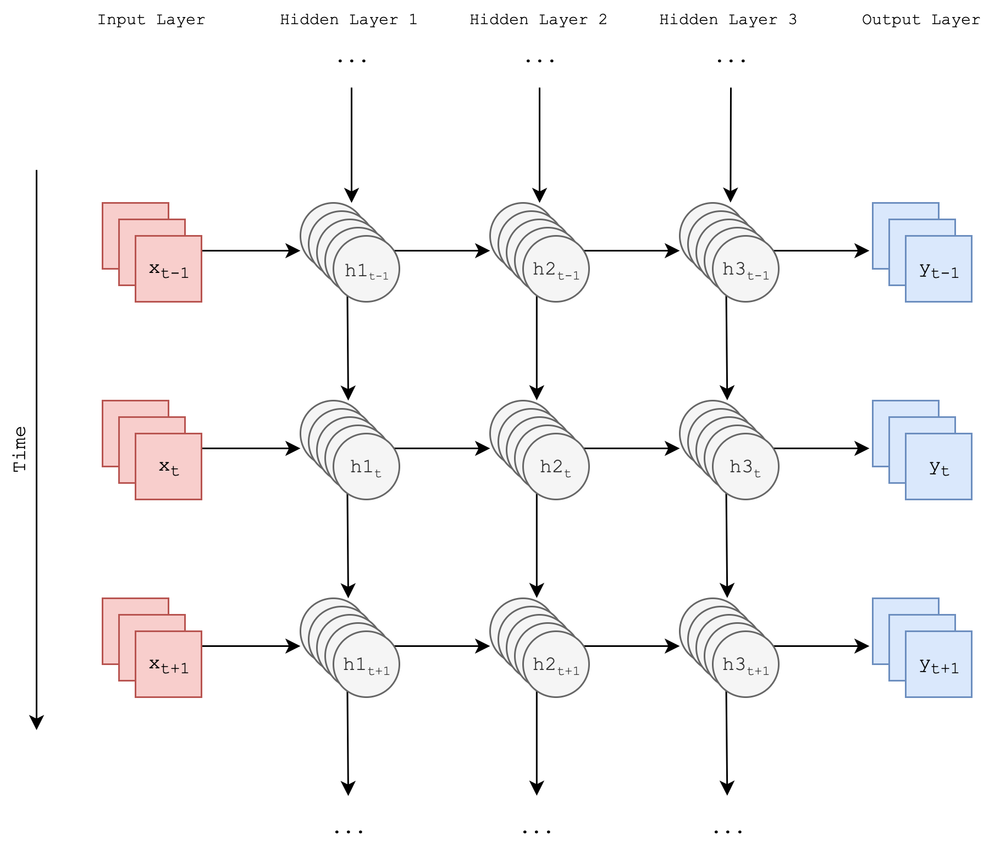

---
output:
  pdf_document:
    includes:
      in_header: init.sty
      before_body: title.sty
    number_sections: true
    toc_depth: 3
    keep_tex: true
bibliography: "Final.bib"
link-citations: yes
csl: ieee.csl
fontsize: 12pt
linkcolor: red
urlcolor: red
keywords: "Recurrent Neural Networks, Machine Learning, Data Science, Probabilistic Sequence Generation, Sentiment Analysis"
---

# Introduction

It is written with regards to the undertaken project exploring the possibilities of musical composition based upon perceived mood of an input and a library of examples with which a compositional engine is to be trained. The main focusses of the project remain on composition as this is the most interesting and challenging component; meaningful contributions to this area would be the most desirable outcome of the project. Given an input from the user, whether it be an image or some text, the main goal is to have a system which will output music to match the perceived sentiment of this input.

This will hopefully lead to the creation of an interactive web application for a user to upload something and receive a composition in return which 'matches' whatever inspiration they provide to the compositional engine. The specification document laid out a number of questions to be answered regarding how this composition should be achieved, a task which has multiple components spanning:

- **A means of transcription.** This must be decided upon to encode input and output data for the compositional engine. The main choices to consider were either raw audio data or MIDI data. This decision was a critical one as not only does it influence the choice of approach for composition, but it also dictates the output of the system: training a model with MIDI data means that it is somewhat limited to responding with MIDI itself. This has led to the consideration of one of the [extensions mentioned below](#synthesiserparameters).
- **A means of composing musical pieces based on sentimental input data from a user alongside training data**; this question is heavily influenced by the answer to the one posed above. The main approaches to consider were a more classical and simple approach involving Markov Chains and stochastic state spaces, in comparison with a very modern and active research subject in composition using Neural Networks.

The project has broadened in scope in some ways with respect to the initial specification, whilst narrowing in others. Namely, constraints on the style of output have been relaxed due to potential issues with creating effective training sets; it remains unclear as to whether ambient is one of the hardest genres of music to compose (a lack of rhythmic elements being a major factor in this theory as they are likely to be the easiest elements to generate) or one of the easiest (less emphasis on continuity and coherence to be maintained throughout allows for more abstract output from the compositional engine which is a possibility).

## Motivation

Since recurrent neural networks rose to prominence in the 1990s. Deep learning has shown great promise in the task of completely automatic musical composition. This is a complex task exploring some challenging computational and philosophical questions in terms of how the "rules" of music might be correctly encapsulated in order to compose musical pieces to eventually compete with what has always been an almost exclusively human process.

There would be contention in explicitly defining rules for something as complex and subjective as music; this is where deep learning's relative impartiality comes in and has already proved effective on a number of previously inaccessible tasks where patterns were not thought to be present, or at least were difficult to capture due to the tasks often being very human in nature.

It is here that the motivation for the project lies. Others have been attempting for decades and this project hopes to contribute to that path of exploration, assessing and utilising a variety of techniques in the hope of replicating at least part of the process of composition. In order to do this assumptions must be made in terms of which parts of human behaviour the model is to imitate.

Ambient music would be used primarily because BLAH

### Brief History of Computational and Algorithmic Approaches to Composition and Musical Applications

Algorithmic composition has developed rapidly in recent years alongside the increase in popularity of deep learning techniques. However, the task and potential solutions pre-date deep learning entirely:

- Markov chains were first formalised in the 1900s and were used to string together segments of score or individual musical notes based on a set of transition probabilities to probabilistically generate sequences of music following conditioning. This conditioning could take place using pre-existing musical score and naturally the outputs tend to follow the inputs closely in terms of style. Iannis Xenakis was a big fan REFERENCE
- Recurrent Neural Networks attempt to extend beyond the main limitations of Markov Chains regarding their restriction to only reproducing subsequences of the original pieces that are used to condition them. These techniques first rose to prominence in the 1980s. The first attempts were usually limited by their lack of coherence beyond a small neighbourhood of notes; the outputs would often lack any real structure or explode into chaos or vanish into silence.
- In the early 2000s, some improvements on RNNs which aimed to solve some of the aforementioned issues were first applied to composition. The first attempt was made by Doug Eck in 2002 [@eck2002finding] and utilised LSTMs.
- Doug now leads the Magenta team at Google Brain [@magenta] who have created a myriad of models mainly focussing on assisted accompaniment for musicians or improvisation with a user. They have continued to apply LSTMs to these problems as well as variations on the Transformer (a sequence model based on self-attention) pioneered by Huang et al. in 2018 [@huang2018improved].
- The field has fragmented in recent years as teams such as Magenta focus more heavily on interaction with a user. Another fragment is focussing on raw audio over MIDI or character representations as has been the standard for decades. The raw audio approach has huge requirements in terms of data and training time making it still somewhat inaccessible for the time being. Although notable research has been carried out by Google again at their Deepmind front via WaveNet [@wavenet]. Other, less creatively focused applications have begun to take hold as well especially within the field of speech synthesis.

There is further discussion to this history if the reader is inclined [@mediumkylemcdonald; @libdlmusic]. The above points cover the main and most relevant milestones and aims to provide some historical context to the starting point of this project.

## Research Objectives

Generative probabilistic models such as recurrent neural networks and their many improvements and variations were the main subject of exploration through research. As well as some perhaps simpler interpretations of the above name like Markov chains and fields. Development of a novel architecture which can compete with existing solutions and better them in as many areas as possible is desirable.

The method is inspired by numerous existing works and recent advances in many fields which reveal that deep learning is increasingly effective when the correct data is present. Formulating and utilising an appropriate data set is therefore of the utmost importance.

The goal of this project is to build a versatile model whose outputs are at best indistinguishable from that of a human and at worst impressive in terms of their structure and harmonic coherence.

## Eventual Objectives and Project Requirements

The main goal 

# Background

## Related Work

### Competitive Existing Solutions

In terms of a symbolic approach (something that was not considered due to lack of training data, using musical scoring in terms of sheet music, lettering representing notes), one of the most impressive was undertaken by Sturm et al. from the KTH Royal Institute of Technology and Kingston University in producing a full album with trained musicians and having it reviewed without revealing the nature of its composition. This is a very effective but resource intensive means of qualitative assessment as well as an effective example of a Turing Test for computational composition tasks. 

Following on from the questions posed in the Specification, a great deal of research has been carried out in order to better define the associated objectives. Resolutions to most of these questions have been reached following testing or further research, and implementations have been attempted where appropriate in order to properly compare the options outlined previously. Balance in terms of resources required and complexity of the task were the main considerations throughout this process, leading to a realistic but challenging set of goals for the future.

### Transcription and Encoding Techniques

The first objective in the composition section of the Specification stated that a decision must be made regarding the format of data used to train the eventual compositional engine. The goal is to build a large library of this data with enough engineered features for the model to successfully produce meaningful output. It has become clear that the use of raw audio data involves a much larger computational overhead making it an infeasible approach given the time-scale of this project. This decision will be discussed at greater length [in the appropriate section](#neuralnetworkapproach); in terms of encoding input data, the decision is mainly based upon the large body of existing research behind MIDI transcription and the intuitiveness of features which arise from relatively simple data such as this. Characteristics such as tempo can be extracted easily and used to train a model on the fundamental 'rules' of music, from which the model can then learn to improvise and compose within certain constraints.

Ableton (a company at the forefront of digital audio technology) employee Anna Wszeborowska spoke at EuroPython 2016 on the applications of Python in encoding from raw audio data to MIDI [@annaw]. Indeed, an implementation to this end has been partially completed, producing some interesting results. Google Brain's Magenta was heralded in the specification as one of the more promising existing tools: a TensorFlow sub-package focussing on musical composition, transcription and other artistic endeavours. The 'Onset Frames' model [@magentaonsetframes] from Magenta's library of pre-trained models uses Neural Networks to transcribe piano pieces to MIDI, and also works reasonably well in transcribing other forms of music.

Cross-validation between this model's output and a method of encoding raw audio to MIDI implemented in Python will be attempted as both approaches have shown themselves to be successful; often one is better than the other depending on the structure of the source. 'Onset Frames' is clearly optimal in the situations it was designed for, whilst implementations attempted in Python give mixed results that are more consistent across different styles of music. The biggest challenges encountered in this part of the project are complex sequences of chords and polyphony in the input from different instruments and vocals. Both of the above techniques can deal with these challenges, but with a slightly lower accuracy than quick successions of monophonic notes for example.

Another option which is yet to be considered is the use of Convolutional Neural Networks. These have been applied extensively in the past to the task of musical transcription [@bereketai; @mbereket; @sigtia2016end] with state-of-the-art results at their resolutions. It is likely that as the project progresses, work on applying this existing research and exploration into the possibilities of other models will continue and be refined to best match the desired output of training data to be used as inputs for the compositional engine. This process exemplifies one of the largest challenges and complexities in this project: using machine learning to *generate* the data used to then compose music in a similar way introduces a lot of uncertainty and dependence between these two components.

### Data

All of the approaches to transcription are impractical to a certain extent following on from the concerns regarding time requirements and uncertainty made above; it is for this reason that some large MIDI data libraries such as the Lakh dataset [@lakh] and Metacreation's corpus [@metacreation] could still be fallen back on if time becomes too constrictive. The existence of such datasets allows for work on the compositional engine to begin without delay, but ideally one of the approaches above will eventually lead to the creation of a similar dataset to be utilised in more intricate feature engineering as well as being a more relevant dataset to the genres of music which comprise the initial focus of this project. The MAESTRO Data Set of MIDI corresponding to piano transcriptions [@maestro2018] is used by Magenta to train their Onset Frames model and so could also form part of the training data for the project.

MIDI is easy to work with and clear in its structure, especially when compared to the complexities of raw audio waveform data. However, there is still the matter of actually using this data to train a model; for this TensorFlow already has a technique for converting MIDI to so-called 'Note Sequences' [@notesequences] which define all the characteristics of a MIDI file in a Pythonic format. This conversion is painless and allows for more standard feature engineering and manipulation techniques to be done inside of Python using familiar packages.

<!-- Million Song Data Set [@Bertin-Mahieux2011] -->

## Composition

### Markovian Approach

This approach involved implementing a learned state-space based upon interpolations of a series of MIDI files. Markov chains could then be implemented to traverse this state-space and sequentially generate new MIDI, building compositions from probabilistic sequences of notes. The idea was to have an 'improvisational' algorithm which could stochastically traverse common progressions and chords, incorporating the ability to switch between these sequences and build a more complex overall piece. Initial work on this approach provided a clear-cut first step to the project as it did not require a huge amount of prior work due to familiarity with the mechanisms and concepts behind it, as well as the existence of other attempts at Markovian composition [@markovcomposer].

The ease of this approach also summarises its main disadvantage: there is a noticeable lack of complexity and novelty in the pieces composed. By its nature, most of the states which the composer can traverse are directly influenced by the input data and thus often lead to sections which are identical to one of the inputs. This could be attributed to a lack of training data, though using more lead to increasingly small transition probabilities and a descent into near randomness, losing a lot of the musicality present in previous outputs along the way.

It is unlikely that this approach will be revisited and although some output was generated, it was not particularly impressive and certainly pales in comparison to some of the witnessed outputs generated by other techniques. It is for this reason that the second of the big objective questions in the Specification could be answered, concluding that Neural Networks should be used for composition rather than Markov Chains.

### Neural Network Approach

These are recurrent neural networks which most importantly for my application have the property of time invariance, in that at a given time step the networks activations and learned properties can all be considered relative to previous time states. The outputs at one time step become inputs for the next and we can use this to sequentially train and generate music without worrying about specific locations or times within the network. To offer a counter example that might make this clearer I would imagine a network composed of a fixed sequence of layers which are visited once and then output to the next layer, dealing with absolute positions would make this kind of network unsuitable for musical composition.

Neural Networks are undoubtedly a very active area of research; a lot of which is relevant or could even be directly applied to this project. For example, "How we Made Music Using Neural Networks" [@alextavgen] references an article by Andrej Karpathy (Tesla's Director of AI); both of these pieces together formulate a good introduction to the technologies to be implemented for a large portion of the remainder of this project. The Karpathy article [@karpathy] showcases some of the capabilities of Recurrent Neural Networks working on generating code, text and images. Music is considered to be a more challenging feat for these systems, which is perhaps intuitive given its continuous and often chaotic nature. The former of the two articles discusses a short exploration into this challenge, a challenge which this project will go further in trying to tackle.

Google's Magenta project was mentioned as one of the main leads for composition. Magenta's collection of pre-trained models is testament to the promise of this platform; more specifically there are pre-trained models available which produce improvisation, polyphony and interpolation of input pieces [@magentavae; @magentapolyphony]. The aim of this project is to build and train a model sitting somewhere between these existing ones, one which is capable of generating inspired sequences of chords and notes and then recurrently feeding these generations back into itself in order to emulate improvisation.

Based on Magenta's current capabilities, an improvisational RNN [@magentaimprov] combined with an LSTM net to improvise off interpolations between existing sources would introduce enough variance and novelty to achieve the goals set for the compositional engine. Preliminary experiments and tests with the models are satisfactory for this application; there are a plethora of provided Jupyter Notebooks to test out the models and interaction is also possible through a command line interface. RNNs are likely to suffer with a lack of global structure, but work well in terms of identifying characteristics of an input and continuing to improvise, in this case. An LSTM would be able to maintain awareness of musical features such as bars, phrases and tempo which should lead to a more acceptable musical output. Hidden layer activations could be used in an RNN to 'remember' what it is doing and where it may be in a musical phrase. However, it is yet to be seen how effective this memory will be in practice.

Considering the work done by Magenta's team and prior explorations into the field by other researchers leads to the conclusion that Neural Networks show more promise for composition than the Markovian approach. This choice links back into the choices made for the format of data to be used to train the models. There are Neural Network based systems which generate MIDI such as Magenta and DeepJazz [@deepjazz], in contrast to some which instead generate raw audio waveforms such as WaveNet, GRUV and SampleRNN [@oord2016wavenet; @Nayebi2015GRUVA; @mehri2016samplernn]. As mentioned previously, using raw audio would be infeasible in a project of this scale and so a lot of the tools and options for composition with Neural Networks could immediately be discarded. The outputs from these other approaches were often more abstract as they were not limited to standard musical notation enforced by MIDI, for example notes would often merge into one another without an initial point of attack.

After carrying out research into different Neural Network structures and use-cases, it can be concluded that a Recurrent Neural Network or LSTM would be the most appropriate implementation for this task due to the allowance for different lengths of input and output compared to something like a Convolutional Neural Network which has fixed input and output sizes. Some very promising work was carried out in studies on music generation from MIDI datasets [@hilschermusic; @wyse2018real] which shows the potential of RNN's for this task. A similar project called DeepJazz was produced in a hackathon in a matter of hours and also gave very promising results, again using an RNN.

<!-- Temporal Sigmoid Belief Networks ???
[@NIPS2015_5655] -->

## User Input and Interface

This component of the project is relatively simple and thus has not been given a great deal of consideration at this stage. A Neural Network approach to image analysis similar to the one described above would allow for the definition of features and characteristics required for the model to gain an understanding of sentiment in music. This could be achieved through labelling and classification of data into different 'moods' or similar groupings which could eventually lead to it matching an input's perceived mood with the type of output it creates. The analysis of images for features is a much simpler task than music; this area of research is also very active, and many examples of such analysis can be found on the internet. It is likely that a lot of the theory and some of the implemented components from the compositional engine could even be reused in image analysis; although here a CNN would likely be more appropriate than an RNN due to the stationary nature of image data.

As mentioned briefly in the report, an image as input is not the only planned way for a user to interact with the compositional engine. It should also be possible for a user to provide textual input or manually set parameters which will again influence the compositional engines output.

## Articles of Interest in the Field

It was clear in the initial stages of this project that the field of computational musical composition is one of intense and rapid development, with a lot of the papers cited being from 2015 and later. Numerous sources of information have been investigated and have proved conducive in terms of inspiration moving forward with the project. For example, the research and updates to Google Brain Team's Magenta Blog [@magenta] have been of great interest throughout the project's development so far as there is a lot of objective overlap.

The general discussion in this blog alongside that found in articles on the internet [@mediumkylemcdonald; @mkofler] helped influence the decision to pursue more complex Neural Network based approaches to composition. Both of these cite Markovian techniques as a *starting point* for this area; something which has quite safely been surpassed in every respect at this point. An article discussing comparisons of various deep learning tools for music generation [@asimovinst] was also informative, highlighting Magenta as a tool of great promise.

Another deep learning tool encountered is GRUV [@nayebi2015gruv], which was mentioned earlier as being an approach trained on raw audio data. It has been used to successfully reproduce some very recognisable snippets of music such as the 'Amen Break' (part of a funk record which has been sampled countless times in popular music) from a set of training data, as well as producing individual instrument sounds [@fiala]. The reproduction of individual instruments could lead to an alternative approach to synthesis and production; layering generated sounds on top of a MIDI composition would be an interesting challenge if the different instruments could somehow be associated with sentiment.

<!-- Reliability of MIDI exporting (done)
 --><!-- http://nbviewer.jupyter.org/github/craffel/midi-ground-truth/blob/master/Reliability%20Experiments.ipynb
 -->

# Methodology

<!-- 
The point is to demonstrate the work was well-planned
• you thought how to approach the work
• you assessed alternatives and the current way was best
• your approach helped you conduct your project in a structured way

To provide a sound basis for any results/conclusions
• Eg: a sample can be justified as representative; the statistical techniques applied to data analysis were appropriate...
• So that others can trust your outcomes/findings

-->

## Research Methodology

The first stages of this project in particular had stringent research requirements in order to formulate an effective approach. There was a large body of work to investigate, much of which consists of research from the past couple of years meaning much of it is still somewhat theoretical or lacking in implementation options. This imposed a requirement of careful thought in terms of which avenues might be worth exploring and which were feasible with the given resources and time-frame.

Due to the scale of the task taken on, and the technical requirements, it was decided that first formulating some research questions would be the best approach.

## Project Management

Agile in places, refer to the initial posed questions and answer them to iteratively come up with a novel and effective approach supported by research and assessment.

PROJECT DEVELOPMENT this is more about the questions posed and how the project crystallised over time.

Meetings for advice and aid in resolving some of the key issues in the project have taken place roughly once or twice per week with the project's supervisor. This is planned to continue, with the meetings likely to increase in frequency due to a much lower external workload in the next academic term.

With most of the preliminary and supporting research complete, as well as the main few directional questions answered, development may continue in earnest. Below is an updated Gantt chart to show how the project's trajectory and schedule has changed since the initial specification, as well as showing confirmation of the completion of some of the defined tasks. There are some slight changes following the issues or decisions discussed earlier in the document, but for the most part the schedule remains unchanged.

## Development Methodology

<!--
Eg: (how) did your approach incorporate reqs analysis, design, modularity, incremental testing, reuse, scalability
(how) did you incorporate the results of user evaluation?

-->

DEVELOPMENT actual programming was iterative combined with agile I guess, rushed to MVP in order to gain better idea of foreign concepts.

Cues were taken from previous development experience alongside agile methodologies to try and accommodate for a flexible, research-driven development process. Deep learning lends itself to trialling ideas and performing evaluation due to the black box nature of some of its components; the task itself does not have a "fixed" optimal solution implying that the development process would have to accommodate for changing requirements and focusses on improvement rather than reaching some pre-determined threshold.

## Ethical Considerations

There are no major ethical considerations in this project. All of the potential issues are briefly discussed here. 

All citations have been checked and are included where necessary to ensure credit is given where existing work has been reused or had a significant influence on the course of the project. The code used for sentiment analysis was based upon the DeepSent project as already mentioned which is present on GitHub under an open source Apache 2.0 license via its creator Mu Chen. The rest of the code included in the technical appendix is referenced where appropriate or entirely original.

A small survey was devised and carried out in order to test a subject's ability to differentiate between human composed pieces and those of the compositional engine. This survey was carried out with willing participants over the internet by sending them a mix of unmarked audio files all synthesised using the same virtual piano. The user is simply asked to categorise them into human and non-human composition folders  before sending them back. This ensures the study was unbiased and also offered the chance to ask for feedback as to the quality of the pieces once a participant had carried out the first task. The results were recorded over a period of 2 weeks and are presented in the evaluation section.

This survey was discussed with the project's supervisor but was deemed to be satisfactory in terms of any ethical considerations; no further justification or recourse was necessary to ensure the ethicacy of it as a means of evaluation.

# MIDI Transcription

In order to determine which MIDI transcriptions were best, a number of factors were considered. Some preliminary testing was done by first designing a sequence of MIDI notes which could then be played internally and exported as an audio file. These MIDI notes acted as a ground truth. Within these test files, chords and complex structures were included as well as different levels of white noise applied to them. From here different techniques could be tried in order to decide which would be best:

- WaoN [@waon] is a transcription tool which converts `.wav` audio files to `.midi` files. It carries out frequency-domain analysis using Fast Fourier Transforms which are computationally intensive but are flexible and accurate when compared to simpler autocorrelational techniques [klapuri2004automatic; gerhard2003pitch] meaning they are often applied to more complex tasks such as pulling out polyphonic features in music as was the goal of this part of the project. This technique requires no training data and so can be quickly applied to a large array of audio; it is not restricted to a specific genre according to its creator and even has means to try and remove drum sounds when transcribing.
- Magenta's 'Onset Frames' model [@magentaonsetframes] is considered cutting edge and utilises a convolutional recurrent neural network architecture to predicts pitch events both in a framewise and onset context. I.e. it first predicts where notes may begin and then uses these predictions to influence predicted frames where a certain pitch is present. Where these predictions are in agreement (an onset is predicted for that pitch within the predicted pitch frame) a note is presumed to be present and can be transcribed to MIDI. Training data and scope again rears its head as an issue with this approach, as is mentioned in the referenced paper.

Based on the transcriptions both create it is possible to compare them qualitatively. Magenta’s approach is decisive in its choice of notes and often more confident when it comes to timing due to its training instilling a greater sense of tempo and structure in its transcriptions. WaoN is delicate and plays with wide dynamic range, but often incorporates more false positives in terms of ghost notes (notes that should not be present but are determined to be through frequency clashes, overtones etc.). Both seemed to be viable and offered slightly different versions of the training data to be used in training the compositional engine, and as both were viable it was decided that both should be used. Magenta's model shows great promise and it is likely that with the correct training data this approach would be far superior to WaoN in fixed domain transcriptions (i.e. training the model on a dataset of ground truth transcriptions of a certain genre before using it to transcribe more of that genre, so that it might understand the 'rules' of transcribing genres other than classical more effectively). I have no doubt that in the next few years applications such as WaoN will be largely eschewed in favour of modern machine learning approaches similar to what has happened to the field of Computer Vision over the past decade or so.

WaoN has numerous tuning parameters. The most regularly used were:

- `-n` for changing the sampling window from the input file, higher number results in fewer samples, as `-n` corresponds to the number of samples in a single step to be analysed
- `-c` allows the user to set the base-10 logarithm of the cut-off ratio upon which velocity of a note should be scaled, i.e. lowering its value allows for weaker notes to be captured
- `-r` does the same but relative to the average velocity, this can be used to remove noisy notes from the outputted MIDI

It was found that decreasing `-c` from its default and increasing `-r` along with a relatively large sampling window `-n` gave the best results with the fewest noisy notes and came closest to emulating the original pieces. These outputs still often included many more ghost notes than Magenta's outputs, but sometimes captured complex structures that Magenta did not, contributing to the final decision to use both approaches in tandem.

## Building a Training Corpus

WaoN and Magenta's Onset Frames model were used to convert a personal library of ambient music containing approximately 1,400 pieces spanning 150 hours into MIDI.

The model was also trained on classical music to make it more comparable to existing offerings, and to reduce some of the issues regarding noisy training data that creating an original corpus presented. The MAPS database was used which is potentially the largest of its kind, providing 1,200 pieces spanning 100 hours in `.wav` format alongside their ground truth MIDI files (the audio and MIDI were recorded together using an electronic piano and microphones, so no MIDI transcription took place like the processes described above, MAPS describes the 'perfect' training set for this kind of model). The raw audio could be used to analyse mood which could then be associated with the MIDI files as before.

## Building an Effective Representation

Most of the code relevant to this section is present in the `dataset.py` and `conversion.py` files included with this document.

After deciding on the raw training data to use, a schema was required to represent the selected MIDI files in a tensor format so that they could be used to train the model. MIDI was converted to tensors by iterating through their files using the python package `mido` [@mido]. It is useful to consider the format of a MIDI file in that they are a stream of messages containing:

- A message class, usually a `Note On` or `Note Off` event, but could also be `End of Track`, `Set Tempo` etc.
- An affected note where applicable, in the range of 0 to 127, this is the standard range of MIDI as a format and represents around 10 octaves
- A velocity associated with `Note On` events, ranging from 0 to 127
- A tick value corresponding to the number of MIDI ticks that have passed since the *previous* event

`mido` allows for iteration through MIDI events in order to generate a sequence of numbers representing a MIDI file's events. In the resulting sequence, the values 0 to 127 are reserved for notes, 128 to 159 are reserved for time and 160 to 192 are reserved for velocity. Time and velocity are packed into bins for performance reasons rather than trying to attempt to represent all possible times and velocity levels; 32 bins were deemed sufficient. Roughly, a new number is appended to the sequence first for the time when an event occurs, then the velocity of said event, then the note itself. If a time exceeds the length of time represented by the $32^{nd}$ time bin, additional numbers are appended to the sequence representing the remaining time.

A MIDI file containing the following events would be converted as below:

$$\begin{gathered}
\text{(Note On Event, Note = 55, Velocity = 90, Tick = 831)} \\
\text{(Note On Event, Note = 67, Velocity = 85, Tick = 3)}\\
\cdots\\
\text{Becomes : } [159, 182, 55, 181, 67, \dots]
\end{gathered}$$

Note that a tick value of 3 is not sufficient to warrant the inclusion of another time-bucketed event meaning that there is no 'gap' between the playing of notes 55 and 67 in this representation. Ticks can be converted to some number of milliseconds meaning that these small changes in time resolution through binning are imperceptible to us as listeners. It was relatively simple to test the efficacy of this representation by converting from MIDI and back and then comparing the input and output MIDI files.

Once the training data is in this form it is randomly sampled into equal length sequences for training purposes. The resulting array representations are one hot encoded to turn them into two-dimensional tensors before being fed into the model in batches. This leads to each element of an input sequence having the dimension:

$$\begin{aligned}
D_{\text{input}} &= \text{Number of Possible MIDI Notes} + \text{Buckets for time} + \text{Buckets for Velocity}\\
&= 128 + 32 + 32\\
&= 192
\end{aligned}$$

The above corresponds to the dimension of a single event vector in a training sequence. In practice, the three-dimensional tensors created through batching and random sampling of training data have the following dimension:

$$\text{Batch Size} \times \text{Training Sequence Length} \times D_{\text{input}}$$

A mood vector is inputted separately and eventually merged with the training sequences by the model using a linear unsqueeze operation to distribute it across the first layers.

# Sentiment Analysis

In order to satisfy the requirements of the project regarding sentiment, it was necessary to first extract the sentiment from each component of the training data corpus and then formulate a means of attaching this sentiment to the representation of the training data to be fed into the model during training.

Much of the technical work regarding extraction of sentiment from audio follows the work done by Mu Chen and their DeepSent project [@deepsent]. This code was used as a basis upon which a vector of mood values could be generated automatically for each element of a training data set and then associated with the accompanying MIDI files to be used in training. The sentiment is measured with respect to an arousal-valence emotional model known as the Circumplex model [@russell1980circumplex], with values being determined for both axes of arousal and valence.

In this context, arousal refers to the perceived intensity of a piece; ranging from a relaxed or somewhat lethargic feeling to a more intense and excited stimulation. Valence is a spectrum of the affect on a listeners level of happiness or sadness which may be incited by the piece. Values for both axes were estimated and ratios calculated to fulfil three ratio values regarding each axis. The ratios are calculated as shown below following predictions made by the models:

$$\begin{aligned}
S_A &= \{\text{Scores assigned to each input by the arousal regressor model}\} \\
\text{Arousal Intense Ratio } &= \frac{\sum_{S_A} \mathbbm{1}_{\text{Score}> 2}}{|S_A|} \\
\text{Arousal Relaxing Ratio } &= \frac{\sum_{S_A} \mathbbm{1}_{\text{Score}< 1}}{|S_A|} \\
\text{Arousal Mid Ratio } &= 1 - (\text{Arousal Intense Ratio} + \text{Arousal Relaxing Ratio}) \\ \\
S_V &= \{\text{Scores assigned to each input by the valence regressor model}\} \\
\text{Valence Happy Ratio } &= \frac{\sum_{S_V} \mathbbm{1}_{\text{Score}> 2}}{|S_V|} \\
\text{Valence Sad Ratio } &= \frac{\sum_{S_V} \mathbbm{1}_{\text{Score}< 1}}{|S_V|} \\
\text{Valence Neutral Ratio } &= 1 - (\text{Valence Happy Ratio} + \text{Valence Sad Ratio}) \\
\end{aligned}$$

In both cases it can be seen that ratios are calculated through taking the top and bottom few scores and calculating the ratio of each above and below boundaries which were formulated through testing and with respect to the original work. It is worth noting that all scores fall between a range of 0 and around 5, but extreme values are clipped to 3 as they do not appear and are often spurious.

## Implementing Signal Processing Technique and Returning the Results in a Usable Form

Most of the code relevant to this section is included in the `mood.py` file included with this document.

Each piece to be analysed is trimmed of its start and end (which are likely to be sparse and potentially irregular in terms of their content when compared to the main body of a piece occurring around its midpoint) to leave the middle 70% of the data. This raw data is then windowed into 5-second long frames of samples, with a step of 0.5 seconds between the starting points of each (such that there is overlap between frames). Within each of these there is then a further decomposition into 25ms sub-frames that are transformed into an array of Mel-frequency cepstral coefficients (MFCCs). The matrices representing the coefficients for each sub-frame are then flattened and fed into a 3-layer neural network regressor. The neural networks associate patterns common within certain moods based upon what was learnt from numerous large datasets used for training these models.

ADD DIAGRAM? HARD

These ratios are then packed into a 6 item vector and associated with each of the training MIDI files to be loaded during training. Thresholding as a means of segmentation was implemented by setting all ratios greater than 50 to 1 and those below 50 to 0. This offered computational improvements but slightly decreased the effectiveness of the mood transfer to training pieces in the opinion of the author and some survey participants. Due to the subjectivity of this part of the output, it was hard to assess which approach was more effective in capturing mood and so the simpler, less computationally intense thresholding option was chosen. This resulted in a six element *binary* vector representing mood associated with each item in the training corpus.

# Creating a Recurrent Model for Musical Composition

## Recurrent Neural Networks

Perhaps the most common form of artificial neural network is the *feedforward* network which utilise connected layers of neurons and activation functions to approximate different functions through the learning of parameters and weights. Their main limitation in this context is that they require their inputs to be of a fixed dimension and thus are not well suited to dynamic data of varying size such as a sequence $(x_t)_{1\le t\le T}$ of time stepped note states representing a composition where $T$ is the length of the piece.

It is assumed that this type of sequential data has some system of dependence on its prior and potentially future elements and so it would not be appropriate to simply input each element of a temporal sequence into a feedforward network during training. It can clearly be seen by observing musical data and considering knowledge of musical harmony (songs are often in a certain and consistent key which may be inferred by chords and notes present throughout the piece) that the input at each time step is likely to be dependent on other time steps.

This class of situations led to the development of **Recurrent Neural Networks** which introduce recurrent connections between layers over a temporal dimension allowing the network to exhibit dynamic behaviour over time.

It is now possible to provide some notation specific to this project regarding RNNs. A training input is defined [as before](#buildinganeffectiverepresentation), with the vector corresponding to the sequence at time $t$ denoted as $x_t\in \{0,1\}^{D_{\text{input}}}$. At each time step, a layer's input $x_t$ and its previous state $h_{t-1}$ are used to calculate a new value $h_t$ for each hidden layer $h\in\{\text{Hidden Layers}\}$ and also inform the outputs for that time step $y_t$. Mathematically, this relationship is as follows:

SOURCE, ALSO SHOULD I TALK MORE ABOUT BACK PROP AND HOW IT ACTUALLY LEARNS, DONT WANT TO COMPLETELY REWRITE RNN PAPERS HAHA

$$\begin{aligned}
h_t &= \phi(W_{xh} x_t + W_{hh} h_{t-1} + b_{xh}) \\
y_t &= W_{hy}(h_t) + b_{hy}
\end{aligned}$$

Where:

- $\phi$ is the chosen element-wise activation function for the network
- $W_{xy}$ represents the weight parameters between layers $x$ and $y$
- $b_{xy}$ is the bias parameter between layers $x$ and $y$

In this case and all proceeding cases, where there are multiple hidden layers, assume that the input for the $n^{\text{th}}$ layer $h^{(n)}_t$ is $x_t = h^{(n-1)}_t$.

This process is illustrated in the figure above and can be described by considering that at the start of the process all weights and activations are initialised to some value. At each time step following this, the new activations for each hidden layer are calculated using a combination of the current time step's input and that layer's previous activations. This process highlights the possibility of unrolling an RNN into a DAG representation as shown in the figure below.

The potentially most important property of this class of networks is their *time invariance*, in that at a given time step the networks activations and learned properties can all be considered relative to previous time steps. The activations at one time step influence the next. The ability to recurrently input into the network is the clear reason for its usage in this context over traditional feedforward networks.

Despite this time invariance and flexibility in terms of the dimension of their inputs, they lack long term coherence meaning they often fail when complex dependencies are built up and different temporal structures must be captured. They are susceptible to exploding or vanishing gradients over time due to repeated and recurrent backpropagation, i.e. tiny values will often compound and be multiplied together leading to the network getting stuck or significantly slowing its learning. These issues have inspired a number of variants aiming to mitigate these problems and form the basis of most current approaches to musical composition. Through considerable research, it was decided that LSTMs and GRUs should be trialled against each other as part of this project's model architecture. They are both discussed in the sections below.

### Long Short-Term Memory Recurrent Units

The LSTM unit was first proposed in 1999 [@gers1999learning], though the version formulated here includes some improvements based on more recent research [@sak2014long; @greff2017lstm; @zebin2018human], the most notable addition is that of the *forget gate*. LSTMs introduce a means of allowing long-term dependencies to be captured by RNNs through introducing three 'gates' which each interact with a memory state and previous hidden activations passed through time:

- The **forget gate** is a scaling factor
$$f_t = \sigma(W_{if} x_t + b_{if} + W_{hf} h_{(t-1)} + b_{hf})$$
where $\sigma(x) = 1 / (1 + e^{-x})$ is the sigmoid function; its values fall in $[0,1]$ and control the extent to which the previous cell memory state $c_{t-1}$ is kept
- The **input gate** is a scaling factor
$$i_t = \sigma(W_{ii} x_t + b_{ii} + W_{hi} h_{(t-1)} + b_{hi})$$
where the terms are self-explanatory; its values fall in $[0,1]$ and control the extent to which the new input $x_t$ flows into the unit
- The **output gate** is a scaling factor
$$o_t = \sigma(W_{io} x_t + b_{io} + W_{ho} h_{(t-1)} + b_{ho})$$
where the terms are self-explanatory; its values fall in $[0,1]$ and control the extent to which the new candidate memory state $c^*_t$ is used to compute the new activation $h_t$

The candidate memory state $c^*_t$ is calculated as
$$c^*_t = \tanh(W_{ic^*} x_t + b_{ic^*} + W_{hc^*} h_{(t-1)} + b_{hc^*})$$
which can then be multiplied element-wise with the input gate scaling factor and added with the result of the forget gate scaling factor's element-wise multiplication with the previous memory state:
$$c_t = f_t \odot c_{t-1} + i_t \odot c^*_t$$
Finally, the new / current hidden activation state can be found as:
$$h_t = o_t \odot \tanh(c_t)$$
All of these weights and bias parameters are updated during training via back-propagation as before and initialised in this instance from the uniform distribution:
$$U(-\sqrt{k}, \sqrt{k}),\quad k = \frac{1}{\text{Hidden Layer Size}}$$

The diagram below illustrates the LSTM and the flow of data through it diagrammatically.

Note that there are many small variations on the LSTM concept; the mathematical formulation was written here in context of PyTorch's implementation [@pytorchlstm] and the figure reflects this.

### Gated Recurrent Units

The GRU was first proposed in 2014 [cho2014learning]. It offers a similar set of operations to try and mitigate the aforementioned issues with RNNs. It does so by introducing two 'gates' in a slightly simpler configuration to the LSTM:

- The **reset gate** is a scaling factor
$$r_t = \sigma(W_{ir} x_t + b_{ir} + W_{hr} h_{(t-1)} + b_{hr})$$
where $\sigma(x) = 1 / (1 + e^{-x})$ is the sigmoid function; its values fall in $[0,1]$ and control the extent to which the previous cell memory state $c_{t-1}$ is kept
- The **update gate** is a scaling factor
$$z_t = \sigma(W_{iz} x_t + b_{iz} + W_{hz} h_{(t-1)} + b_{hz})$$
where the terms are self-explanatory; its values fall in $[0,1]$ and control the extent to which the unit's activation is updated

The candidate activation state $h_t^*$ is calculated as
$$h_t^* = \tanh(W_{ih^*} x_t + b_{ih^*} + r_t (W_{hh^*} h_{(t-1)} + b_{hh^*}))$$
which can then be used in calculating the new / current activation via a linear interpolation of the candidate activation and the previous activation:
$$h_t = h_{t-1} (1 - z_t) + h_t^* z_t$$

The diagram below illustrates the GRU and the flow of data through it diagrammatically.

Note that there are many small variations on the GRU concept; the mathematical formulation was written here in context of PyTorch's implementation [@pytorchgru] and the figure reflects this.

## Dilation

The concept of dilation was first proposed in the context of convolutional neural networks [@yu2015multi] for image analysis and semantic segmentation; this work was discovered during research for a [potential extension](#sentimentalinputfromimages) of this project. The main concept is to aggregate information at different contextual scalings without losing resolution by exploding a kernel's considered neighbourhood around a central pixel / element. This is done to increase the likelihood of discovering pattern structures at different resolutions within an input as well as increasing the area of an image or input which can be considered through a small number of steps.

It offers an alternative to other techniques often relying on down-sampling which sacrifice resolution rather than considering different contexts at full resolution as is the case with dilation.

{width=70%}

This technique has shown to be very effective in aiding dense prediction problems (predicting labels for each pixel in an image, or with respect to this project's proposed equivalence of predicting on or off states for each note on the piano over a series of time steps). Deepmind researchers applied a similar approach within their own convolutional network for WaveNet which is the first documented use of dilation in the musical composition domain [@oord2016wavenet]. Their results found that again the addition of dilation increased the accuracy and effectiveness of their model.

A paper was published linking this concept with recurrent neural networks in 2017 [@chang2017dilated]. This paper forms the basis for the justification of using dilation in the model present in this project; this project's compositional model is potentially the first use of dilated recurrent neural networks in the musical composition domain. Dilation's purpose in this context is to allow a model to learn at multiple temporal resolutions and capture the complexities of musical composition that exist naturally through its formulation in terms of half and double length notes, beats, bars etc. This immediately lends itself to dilation POWERS OF 2.

{width=100%}

{width=70%}

Mathematically, dilation can be achieved by simply reconnecting the network's layers such that all of the aforemenetioned recurrent operations are done with respect to $t-D_l$ rather than $t-1$ where $D_l$ is the dilation factor of layer $l$. Enhanced parallelisation can be achieved by computing dilated layers together at the same time as illustrated below:

## Introducing Harmonic Invariance

The consideration of musical theory is the main inspiration for the following section. There is a large body of documentation and research surrounding musical theory which a reader could investigate should they wish to supplement this paper with additional context. However, the essentials and relevant points are included for convenience.

In general, compositions are written with respect to a **key** which roughly determines the scales upon which harmonics and chords for a piece are constructed. Each key is simply a transformation or rather a transposition of another through some number of shifts up or down.

{height=40%}

{height=30%}

This highlights a potential issue with many pre-existing attempts at composition using neural networks and limitations of some distribution estimators such as Restricted Boltzmann Machines and Neural Autoregressive Distribution Estimators. Many modern approaches utilise these units in their models, but they involve a fixed distribution which generates probabilities for each note deterministically, i.e. one probability for each possible note. 

All of the harmonics present in music (aside from some intentional dissonances) are entirely relative by nature. For example, if we represent all possible played MIDI notes as a 128-element binary vector where 1 represents a played note and 0 represents the lack of a note at this location. A major triad chord can be represented as:

$$... 0100010010 ...$$

This arrangement forms a major triad with respect to some root note / key regardless of its absolute position in the input sequence; the only rules for creating a major triad is to start with a note, then add its major third (always 4 keys to the right of the root) and perfect fifth (always a further three keys from the major third). This highlights the property of **harmonic invariance** in music. Many of the aforementioned solutions including most of the ones discussed in the section on [pre-eminent solutions](#competitiveexistingsolutions) utilise architectures which mean that they would have to learn each transposed chord separately. This immediately seems to ignore this concept of harmonic invariance and relativity in musical scoring which is key to having a model understand its rules beyond a single key.

Inspiration can be drawn once more from convolutional neural networks which achieve invariance in analysing images by utilising multiple kernel functions which each learn relative features in the data as they are passed over the image. To achieve this, the input data is cross-correlated meaning that the output is identical for inputs $u_{(i + x)}$ and $v_{(j+x)}$, for all fixed $i,j$ and any offset $x$.

The idea is to apply this concept to the model such that all inputs of the same offset are treated equally to each other, by considering their positions relatively rather than absolutely.

## The Model Itself

The culmination of all of this results in a network consisting of Dilated GRU or LSTM units, tied such that they are invariant temporally and harmonically. Both GRU and LSTM units were evaluated due to their similarities and seeming applicability to the task.

## Testing

Functional testing, unit testing, integration testing ? testing strategies

<!-- 
For software: design and implementation.
• Balance between high level (to give overall picture) and some
lower level details
• Some more detailed parts are useful to illustrate what/how
you’ve done things
• Make sure to show the challenging areas unless obvious.
• Use of appendices and in-text design/code snippets.
Presentation and discussion of results/evaluation.
-->

# Evaluation

as well as from JSB Chorales, MuseData, Nottingham and Piano-Midi.de which are all relatively standard datasets used for this task

One of the main issues is the propogation of noise or errors throughout the system, starting with MIDI transcription

## Conclusions

A favourable configuration was found though further investigation would be required. The function aimed for is a complex one and it is still somewhat unclear how many neurons might work best in modelling the full potential. Here resources of time and computational power must be considered. 

## Internal Comparison of Work

Compare different layer configurations, pyramid and number of units and also GRU and LSTM.

## Contextualised Comparisons with Existing Solutions

Insert the tables of comparisons with existing solutions

## Qualitative Surveying Assessment

# Future Work

## Improved Data Collection and Corpus Creation

As has already been alluded to, perhaps the biggest issue faced throughout this project has been one of data. New architectures were developed and tested iteratively but all of them faced similar limitations due to a lack of data. The model itself proved to be close to state-of-the-art through its training performance and quantitative evaluation. However, many of the pieces still seemed to leave something to be desired; especially when the created ambient corpus was used 

GPT-2 [@radford2018language]

## Sentimental Input from Images

## Alternative Architectures

Some other recent developments in the space of recurrent units could offer improvements to the current architecture. It would be desirable to further investigate Statistical Recurrent Units which are similar in practice to GRUs but substitute . Moving averages are promising for again maintaining long term coherence and effectively representing long term dependencies in the training data.

## Performance and Interactivity

This project proves that additional features can effectively be incorporated into the model. Indeed, a mood may be input at the time of generation in order to influence the model's output. A natural extension of this would be to provide additional ways to interact with the model at the point of generation through giving a user the chance to manually inspire the model. This could potentially be as intuitive as allowing a user to play a short number of notes or chords and have these set the initial weightings for the network, which would presumably go on to compose a whole piece from these starting conditions. This would certainly be possible given a greater corpus of training data to allow for the model to have a greater understanding of shorter inputs; could allow for musicians to use the model creatively in terms of inputting short ideas into it and exploring its responses.

Many of the Magenta team's efforts since the launch of interactive TensorFlow.js have incorporated ideas such as these; it is relatively simple to hook up a MIDI interface into the model such that it could receive input in a way similar to how some of the Magenta models do.

In order to further build upon the user experience of this project, a simple web app could be built to contribute to a larger population size for the [surveying method](#qualitativesurveryingmethod) described in the evaluation section. The web app would allow for a user to input a mood either by setting the Circumplex parameters manually or potentially tying in the use of an uploaded image or even NLU to analyse the mood of a sentence and then feed this into the model to generate an appropriate piece. The hosting of a pre-trained model would be relatively simple to achieve and again was not deemed to be of sufficient value to justify the time and resource cost during this project as it was not key to the initially laid out requirements. Despite this, it could potentially gain traction online and provide a much larger sample size for automated collection of qualitative assessment data regarding the model.

## Synthesiser Parameters

Other researchers have successfully trained a model to change parameters of a synthesiser during live performance based on a musician's input and learned preferences [@sommer2014towards]. Moving forward this would be an excellent way to add another dimension to the project's outputted music; existing studies into the sentiments behind different timbres and urgency or latency introduced by manipulations of note attack-delay-sustain-release parameters could form a basis of some quantitative assessment of the results. The input could again influence the output through affecting the choice of parameter programming for the synthesiser used to play the compositions the system produces.

One of the limitations in choosing to train a model on MIDI as mentioned earlier is that the output is also somewhat restricted to this format. At which point choices could be made in terms of how this MIDI is synthesised and played back to the user. This could range from something as simple as instrumental selection, to the tuning of parameters of a chosen synthesis engine as described here.

# Author's Assessment of the Project

<!-- As alluded to in the schedule, time has been scarce this term and some additional unforeseen issues have hindered objective completion. Despite this, the progress made has been significant in terms of gaining the appropriate knowledge through research and narrowing the scope of the project to a more linear series of steps. This allows for a more confident assurance of a good resolution to the project, especially in the areas of composition and encoding.

One of the biggest challenges faced so far arose due to the initial design of the project: having a lot of avenues to explore is time consuming but was necessary in this instance due to a lack of the prior understanding required to make these judgements from the start. Moving forward these decisions will be adhered to as closely as possible, ensuring focus remains on the current objectives. Regardless of the strategy moving forward, most of this deliberation ends with the main research component of the project which is now complete.
 -->

The work discussed indicates the level of technical achievement this project encompasses. Much of the work is of a high level for a third year project and involved significant time investment to learn additional advanced material with which to accomplish the goals of the project. 

The use of neural networks and deep learning is adherent to the description of my degree; probablistic sequence generation is certainly relevant in almost all aspects to the statistical and computational nature of the BSc in Data Science. The project illustrates domain knowledge spanning multiple fields relevant to data science and involved numerous challenging components from a research, theoretical, technical and engineering perspective.

It is hoped that this work forms a relatively robust and all-encompassing summary of not only the outputs of the project but the work involved in achieving it. Other academics and students will hopefully find value in this work and be able to continue to contribute to this fast-moving field. Musical composition as mentioned is a sufficiently complex task to fully leverage some of the more advanced deep learning and sequential modelling techniques which are currently of interest in academia; this work shows their potential applications as well as hopefully contributing to their further development.

Why should this project be considered an achievement?

The incorporation of mood is perhaps the initial limitation an observer may encounter in terms of the initial goals of the project.

# References