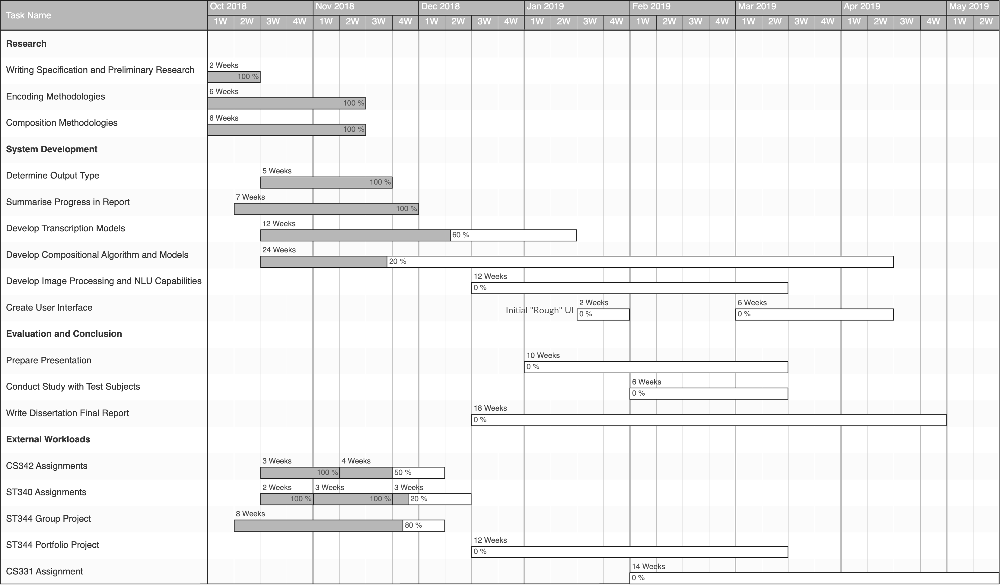

# Introduction

This document will serve as an extension and conclusion to some of what was discussed in the Specification [@specification] submitted a number of weeks ago. It is written with regards to the undertaken project exploring the possibilities of musical composition based upon perceived mood of an input and a library of examples with which a compositional engine is to be trained. The main focusses of the project remain on composition as this is the most interesting and challenging component; meaningful contributions to this area would be the most desirable outcome of the project. Given an input from the user, whether it be an image or some text, the main goal is to have a system which will output music to match the perceived sentiment of this input.

This will hopefully lead to the creation of an interactive web application for a user to upload something and receive a composition in return which 'matches' whatever inspiration they provide to the compositional engine. The specification document laid out a number of questions to be answered regarding how this composition should be achieved, a task which has multiple components spanning:

- **A means of transcription.** This must be decided upon to encode input and output data for the compositional engine. The main choices to consider were either raw audio data or MIDI data. This decision was a critical one as not only does it influence the choice of approach for composition, but it also dictates the output of the system: training a model with MIDI data means that it is somewhat limited to responding with MIDI itself. This has led to the consideration of one of the [extensions mentioned below](#synthesiserparameters).
- **A means of composing musical pieces based on sentimental input data from a user alongside training data**; this question is heavily influenced by the answer to the one posed above. The main approaches to consider were a more classical and simple approach involving Markov Chains and stochastic state spaces, in comparison with a very modern and active research subject in composition using Neural Networks.

The project has broadened in scope in some ways with respect to the initial specification, whilst narrowing in others. Namely, constraints on the style of output have been relaxed due to potential issues with creating effective training sets; it remains unclear as to whether ambient is one of the hardest genres of music to compose (a lack of rhythmic elements being a major factor in this theory as they are likely to be the easiest elements to generate) or one of the easiest (less emphasis on continuity and coherence to be maintained throughout allows for more abstract output from the compositional engine which is a possibility).

# Research and Current Implementation

Following on from the questions posed in the Specification, a great deal of research has been carried out in order to better define the associated objectives. Resolutions to most of these questions have been reached following testing or further research, and implementations have been attempted where appropriate in order to properly compare the options outlined previously. Balance in terms of resources required and complexity of the task were the main considerations throughout this process, leading to a realistic but challenging set of goals for the future.

## Transcription and Encoding Techniques

The first objective in the composition section of the Specification stated that a decision must be made regarding the format of data used to train the eventual compositional engine. The goal is to build a large library of this data with enough engineered features for the model to successfully produce meaningful output. It has become clear that the use of raw audio data involves a much larger computational overhead making it an infeasible approach given the time-scale of this project. This decision will be discussed at greater length [in the appropriate section](#neuralnetworkapproach); in terms of encoding input data, the decision is mainly based upon the large body of existing research behind MIDI transcription and the intuitiveness of features which arise from relatively simple data such as this. Characteristics such as tempo can be extracted easily and used to train a model on the fundamental 'rules' of music, from which the model can then learn to improvise and compose within certain constraints.

Ableton (a company at the forefront of digital audio technology) employee Anna Wszeborowska spoke at EuroPython 2016 on the applications of Python in encoding from raw audio data to MIDI [@annaw]. Indeed, an implementation to this end has been partially completed, producing some interesting results. Google Brain's Magenta was heralded in the specification as one of the more promising existing tools: a TensorFlow sub-package focussing on musical composition, transcription and other artistic endeavours. The 'Onset Frames' model [@magentaonsetframes] from Magenta's library of pre-trained models uses Neural Networks to transcribe piano pieces to MIDI, and also works reasonably well in transcribing other forms of music.

Cross-validation between this model's output and a method of encoding raw audio to MIDI implemented in Python will be attempted as both approaches have shown themselves to be successful; often one is better than the other depending on the structure of the source. 'Onset Frames' is clearly optimal in the situations it was designed for, whilst implementations attempted in Python give mixed results that are more consistent across different styles of music. The biggest challenges encountered in this part of the project are complex sequences of chords and polyphony in the input from different instruments and vocals. Both of the above techniques can deal with these challenges, but with a slightly lower accuracy than quick successions of monophonic notes for example.

Another option which is yet to be considered is the use of Convolutional Neural Networks. These have been applied extensively in the past to the task of musical transcription [@bereketai; @mbereket; @sigtia2016end] with state-of-the-art results at their resolutions. It is likely that as the project progresses, work on applying this existing research and exploration into the possibilities of other models will continue and be refined to best match the desired output of training data to be used as inputs for the compositional engine. This process exemplifies one of the largest challenges and complexities in this project: using machine learning to *generate* the data used to then compose music in a similar way introduces a lot of uncertainty and dependence between these two components.

Another possibility is to use Melodyne [@melodyne], a simple (but expensive) software which has a high accuracy in transcribing to MIDI but requires manual input of each audio file and has rather long processing times making it impractical for constructing a comprehensive training library.
<!-- http://helpcenter.celemony.com/hc-2/doc/melodyneStudio4/en/M4tour_AudioAlgorithms?env=standAlone
https://ulethelectro.wordpress.com/2013/03/15/using-melodyne-to-extract-midi-information-from-an-audio-source/ -->

### Data

All of the approaches to transcription are impractical to a certain extent following on from the concerns regarding time requirements and uncertainty made above; it is for this reason that some large MIDI data libraries such as the Lakh dataset [@lakh] and Metacreation's corpus [@metacreation] could still be fallen back on if time becomes too constrictive. The existence of such datasets allows for work on the compositional engine to begin without delay, but ideally one of the approaches above will eventually lead to the creation of a similar dataset to be utilised in more intricate feature engineering as well as being a more relevant dataset to the genres of music which comprise the initial focus of this project. The MAESTRO Data Set of MIDI corresponding to piano transcriptions [@maestro2018] is used by Magenta to train their Onset Frames model and so could also form part of the training data for the project.

MIDI is easy to work with and clear in its structure, especially when compared to the complexities of raw audio waveform data. However, there is still the matter of actually using this data to train a model; for this TensorFlow already has a technique for converting MIDI to so-called 'Note Sequences' [@notesequences] which define all the characteristics of a MIDI file in a Pythonic format. This conversion is painless and allows for more standard feature engineering and manipulation techniques to be done inside of Python using familiar packages.

<!-- Million Song Data Set [@Bertin-Mahieux2011] -->

## Composition

### Markovian Approach

This approach involved implementing a learned state-space based upon interpolations of a series of MIDI files. Markov chains could then be implemented to traverse this state-space and sequentially generate new MIDI, building compositions from probabilistic sequences of notes. The idea was to have an 'improvisational' algorithm which could stochastically traverse common progressions and chords, incorporating the ability to switch between these sequences and build a more complex overall piece. Initial work on this approach provided a clear-cut first step to the project as it did not require a huge amount of prior work due to familiarity with the mechanisms and concepts behind it, as well as the existence of other attempts at Markovian composition [@markovcomposer].

The ease of this approach also summarises its main disadvantage: there is a noticeable lack of complexity and novelty in the pieces composed. By its nature, most of the states which the composer can traverse are directly influenced by the input data and thus often lead to sections which are identical to one of the inputs. This could be attributed to a lack of training data, though using more lead to increasingly small transition probabilities and a descent into near randomness, losing a lot of the musicality present in previous outputs along the way.

It is unlikely that this approach will be revisited and although some output was generated, it was not particularly impressive and certainly pales in comparison to some of the witnessed outputs generated by other techniques. It is for this reason that the second of the big objective questions in the Specification could be answered, concluding that Neural Networks should be used for composition rather than Markov Chains.

### Neural Network Approach

Neural Networks are undoubtedly a very active area of research; a lot of which is relevant or could even be directly applied to this project. For example, "How we Made Music Using Neural Networks" [@alextavgen] references an article by Andrej Karpathy (Tesla's Director of AI); both of these pieces together formulate a good introduction to the technologies to be implemented for a large portion of the remainder of this project. The Karpathy article [@karpathy] showcases some of the capabilities of Recurrent Neural Networks working on generating code, text and images. Music is considered to be a more challenging feat for these systems, which is perhaps intuitive given its continuous and often chaotic nature. The former of the two articles discusses a short exploration into this challenge, a challenge which this project will go further in trying to tackle.

Google's Magenta project was mentioned as one of the main leads for composition in the specification and remains so at this point in the project. Magenta's collection of pre-trained models is testament to the promise of this platform; more specifically there are pre-trained models available which produce improvisation, polyphony and interpolation of input pieces [@magentavae; @magentapolyphony]. The aim of this project is to build and train a model sitting somewhere between these existing ones, one which is capable of generating inspired sequences of chords and notes and then recurrently feeding these generations back into itself in order to emulate improvisation.

Based on Magenta's current capabilities, an improvisational RNN [@magentaimprov] combined with an LSTM net to improvise off interpolations between existing sources would introduce enough variance and novelty to achieve the goals set for the compositional engine. Preliminary experiments and tests with the models are satisfactory for this application; there are a plethora of provided Jupyter Notebooks to test out the models and interaction is also possible through a command line interface. RNNs are likely to suffer with a lack of global structure, but work well in terms of identifying characteristics of an input and continuing to improvise, in this case. An LSTM would be able to maintain awareness of musical features such as bars, phrases and tempo which should lead to a more acceptable musical output. Hidden layer activations could be used in an RNN to 'remember' what it is doing and where it may be in a musical phrase. However, it is yet to be seen how effective this memory will be in practice.

Considering the work done by Magenta's team and prior explorations into the field by other researchers leads to the conclusion that Neural Networks show more promise for composition than the Markovian approach. This choice links back into the choices made for the format of data to be used to train the models. There are Neural Network based systems which generate MIDI such as Magenta and DeepJazz [@deepjazz], in contrast to some which instead generate raw audio waveforms such as WaveNet, GRUV and SampleRNN [@oord2016wavenet; @Nayebi2015GRUVA; @mehri2016samplernn]. As mentioned previously, using raw audio would be infeasible in a project of this scale and so a lot of the tools and options for composition with Neural Networks could immediately be discarded. The outputs from these other approaches were often more abstract as they were not limited to standard musical notation enforced by MIDI, for example notes would often merge into one another without an initial point of attack.

After carrying out research into different Neural Network structures and use-cases, it can be concluded that a Recurrent Neural Network or LSTM would be the most appropriate implementation for this task due to the allowance for different lengths of input and output compared to something like a Convolutional Neural Network which has fixed input and output sizes. Some very promising work was carried out in studies on music generation from MIDI datasets [@hilschermusic; @wyse2018real] which shows the potential of RNN's for this task. A similar project called DeepJazz was produced in a hackathon in a matter of hours and also gave very promising results, again using an RNN.

<!-- Temporal Sigmoid Belief Networks ???
[@NIPS2015_5655] -->

## User Input and Interface

This component of the project is relatively simple and thus has not been given a great deal of consideration at this stage. A Neural Network approach to image analysis similar to the one described above would allow for the definition of features and characteristics required for the model to gain an understanding of sentiment in music. This could be achieved through labelling and classification of data into different 'moods' or similar groupings which could eventually lead to it matching an input's perceived mood with the type of output it creates. The analysis of images for features is a much simpler task than music; this area of research is also very active, and many examples of such analysis can be found on the internet. It is likely that a lot of the theory and some of the implemented components from the compositional engine could even be reused in image analysis; although here a CNN would likely be more appropriate than an RNN due to the stationary nature of image data.

As mentioned briefly in the report, an image as input is not the only planned way for a user to interact with the compositional engine. It should also be possible for a user to provide textual input or manually set parameters which will again influence the compositional engines output.

## Articles of Interest in the Field

It was clear in the initial stages of this project that the field of computational musical composition is one of intense and rapid development, with a lot of the papers cited being from 2015 and later. Numerous sources of information have been investigated and have proved conducive in terms of inspiration moving forward with the project. For example, the research and updates to Google Brain Team's Magenta Blog [@magenta] have been of great interest throughout the project's development so far as there is a lot of objective overlap.

The general discussion in this blog alongside that found in articles on the internet [@mediumkylemcdonald; @mkofler] helped influence the decision to pursue more complex Neural Network based approaches to composition. Both of these cite Markovian techniques as a *starting point* for this area; something which has quite safely been surpassed in every respect at this point. An article discussing comparisons of various deep learning tools for music generation [@asimovinst] was also informative, highlighting Magenta as a tool of great promise.

Another deep learning tool encountered is GRUV [@nayebi2015gruv], which was mentioned earlier as being an approach trained on raw audio data. It has been used to successfully reproduce some very recognisable snippets of music such as the 'Amen Break' (part of a funk record which has been sampled countless times in popular music) from a set of training data, as well as producing individual instrument sounds [@fiala]. The reproduction of individual instruments could lead to an alternative approach to synthesis and production; layering generated sounds on top of a MIDI composition would be an interesting challenge if the different instruments could somehow be associated with sentiment.

<!-- Reliability of MIDI exporting (done)
 --><!-- http://nbviewer.jupyter.org/github/craffel/midi-ground-truth/blob/master/Reliability%20Experiments.ipynb
 -->
## Extensions

### Performance and Interactivity

One of the most interesting extensions of this project would be to enable the most obvious and intuitive *application* of it. A means of performance or interactivity would be desirable given the chance; Magenta again could be used for this with its MIDI Interface [@magentamidi], allowing for the use of a virtualised MIDI Controller called VMPK [@vmpk] and Software Synthesiser FluidSynth [@fluidsynth].

The default purpose of the MIDI Interface is to allow for a user to play a duet with the computer. In the context of this project, it could allow a user to give the compositional engine some initial inspiration or guidance and then allow it to compose as it would based upon the usual inputs.

### Synthesiser Parameters

Other researchers have successfully trained a model to change parameters of a synthesiser during live performance based on a musician's input and learned preferences [@sommer2014towards]. Moving forward this would be an excellent way to add another dimension to the project's outputted music; existing studies into the sentiments behind different timbres and urgency or latency introduced by manipulations of note attack-delay-sustain-release parameters could form a basis of some quantitative assessment of the results. The input could again influence the output through affecting the choice of parameter programming for the synthesiser used to play the compositions the system produces.

One of the limitations in choosing to train a model on MIDI as mentioned earlier is that the output is also somewhat restricted to this format. At which point choices could be made in terms of how this MIDI is synthesised and played back to the user. This could range from something as simple as instrumental selection, to the tuning of parameters of a chosen synthesis engine as described here.

<!-- SuperCollider, live elements [@supercollider]
# Current Implementation (Hopefully Something)

source activate magenta
fluidsynth
vmpk

magenta_midi --list_ports
CONTROLLER_PORT="VMPK Output"
SYNTH_PORT="VMPK Input"
BUNDLE_PATHS="/Users/harrisonwilde/OneDrive/University/Y3/Dissertation/MagentaModels"
-->

# Trajectory

It has now been decided and justified that a Neural Network approach generating MIDI will be followed; development of this system will continue well into next term as it is the main component of the project to be implemented. Discussion will take place early next term with regards to the User Interface and Image Recognition components of the project. These elements are not discussed in great detail in this report as they remain largely unchanged from their initial specification conceptually and are expected to be relatively simple. The research into Neural Network applications in music provides reassurance of this simplicity; if features can be found in MIDI they most certainly can be found in images and classified into the parameters desired for inputs to the compositional engine.

Over the next few weeks, more thought will be put into the design of the Neural Network for composition and a library of training data will be accumulated with sentimental features to influence composition being defined as it is built.

## Project Management

Meetings for advice and aid in resolving some of the key issues in the project have taken place roughly once or twice per week with the project's supervisor. This is planned to continue, with the meetings likely to increase in frequency due to a much lower external workload in the next academic term.

With most of the preliminary and supporting research complete, as well as the main few directional questions answered, development may continue in earnest. Below is an updated Gantt chart to show how the project's trajectory and schedule has changed since the initial specification, as well as showing confirmation of the completion of some of the defined tasks. There are some slight changes following the issues or decisions discussed earlier in the document, but for the most part the schedule remains unchanged.

# Reflection and Assessment

As alluded to in the schedule, time has been scarce this term and some additional unforeseen issues have hindered objective completion. Despite this, the progress made has been significant in terms of gaining the appropriate knowledge through research and narrowing the scope of the project to a more linear series of steps. This allows for a more confident assurance of a good resolution to the project, especially in the areas of composition and encoding.

One of the biggest challenges faced so far arose due to the initial design of the project: having a lot of avenues to explore is time consuming but was necessary in this instance due to a lack of the prior understanding required to make these judgements from the start. Moving forward these decisions will be adhered to as closely as possible, ensuring focus remains on the current objectives. Regardless of the strategy moving forward, most of this deliberation ends with the main research component of the project which is now complete.

## Ethical Considerations

All of the software and projects mentioned so far are freely available and open source - with the exception of Melodyne - meaning there are no issues in terms of re-use or forking code for the purposes of this project. Similarly, the use of any of the datasets mentioned above falls within the relevant fair-use laws.

It would still be desirable to carry out a survey with some test subjects to gain qualitative and unbiased assessment of the finished system. However, given the time constraints and nature of the project this is not considered critical as there are plenty of other, less time-consuming means of assessing the outcomes.

## Risks

The computational overheads in training Neural Networks pose a new risk in terms of the resources and time required, a risk which is much greater than that present in the attempted Markovian approach. However, the results are deemed to be worth these overheads and it is possible to utilise resources provided by the University of Warwick's Department of Computer Science [@warwickcomputenodes] to ensure continued feasibility of the project in these circumstances.

Further unforeseen circumstances or periods of illness could occur. The risk of these situations significantly impacting the project is slim and can be mitigated by trying to remain within the bounds of the schedule for the rest of the project. The time allowances defined in the Gantt scheduling chart for each task are pessimistic to provide a time buffer which may be used elsewhere if not needed or otherwise consumed. Illness did have some effect this term, but the time can easily be made up over the next few weeks.

# References