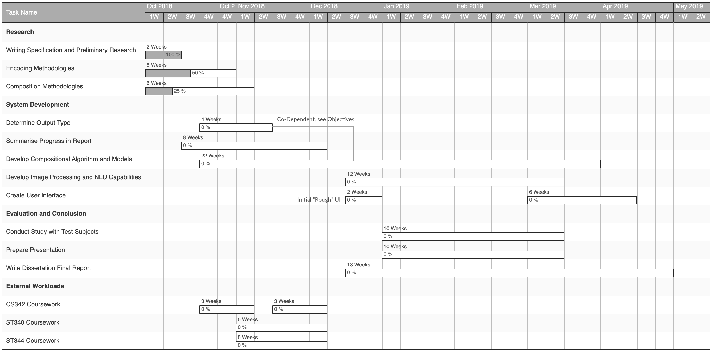

\pagebreak

# Problem Statement

With the onset of more complex pattern learning and generating approaches, it is becoming increasingly feasible for a computer to produce seemingly novel and creative artistic output. This project will focus on combining research into techniques of computational composition with processing visual or textual input to provide parameters to the resulting compositional engine. Namely, an image or mood (textual) will be uploaded by the user and analysed to provide tuning parameters to an engine which will then output music in order to construct a soundscape matching the atmosphere of the supplied input.

There are numerous hurdles to overcome when building a system like this and it can thankfully be broken down into some smaller components:

+ The composition of music is the initial focus of this project as it is presumed to eventually become the largest and most involved component.
+ There will also be the challenge of processing images and / or text via NLP to provide parameters for the resulting composition engine.
+ Allowing these processes to interact may require the creation of new models and thus the discovery of appropriate datasets with which to train them.
+ An interface must also be supplied to allow interaction with the system.

As mentioned in the [Current Literature](#current-literature) section, some work in this area already exists. However, the outcome of this project should still be original and interesting, especially with regards to the research which will take place in order for each objective to be reached through comparison of different techniques. It is a challenging set of problems, each of which could be expanded upon or constricted (through the use of off-the-shelf solutions or pre-existing methodologies) to maintain a flexible approach to the project as it progresses and protect from any unforeseen obstructions to the eventual goal.

This project provides a contextual and interactive view of progress made in the fields it touches, and could have applications in experimental live performance or entertainment for a user (relaxation, meditation etc.).

# Objectives

The main objective of this project is to produce a meaningful musical output, which is as verifiably "human" in the nature of its composition as possible. This description is perhaps too qualitative and requires breaking down further; the primary initial objectives are certainly focussed on the research and the eventual comparison of different techniques for achieving the goal mentioned above. A system must then be built and tuned to ensure the goal is reached in a desirable way. Finally, the project's culmination must be evaluated as rigorously as possible.

Note that where two approaches are discussed it would be most favourable to explore both, but this may not always be feasible.

## Composition

1. A means of encoding music into a format acceptable for training a model or agent must be developed, likely using a sizeable training set of data (appropriate data sets are to be found as part of the research portion of the schedule); there are currently two approaches which will be considered and compared:
	a. **Using MIDI or sheet music data**, either from a raw source or through the use of a note / chord detection software. This is the more quantifiable approach and likely allows for the most flexibility in **2.2**.
	b. **Using signal / waveform data** to train a neural network is a more abstract approach in that the output would be much more complex and so harder to quantify, though it has been achieved multiple times in the past by other researchers.

2. The actual composition of music could then be carried out in one of two ways which will be considered and the research behind this recorded to allow for comparisons and conclusions to be drawn:
	a. **Markov chains** could be used as Iannis Xenakis explores in Formalized Music [@nla.cat-vn250479], constructing sequences of notes based upon common progressions and harmonious chords, found via the analysis of large datasets of music as eluded to in **2.1.1**. This approach would work stochastically, a model constructed by analysing chord structures and progressions would consist of state spaces and transition probabilities which the algorithm could then traverse to dynamically generate musical output; favouring harmonious chords and certain keys / progressions depending on supplied parameters.
	b. **Neural networks** as mentioned in **2.1.1b** and the use of Google Brain's Magenta [@magenta] show promise, as Magenta has a proven track record in the areas of music composition once an appropriate model is chosen. This is a more raw approach in terms of being able to work with audio data directly, though a lot of the time this can lead to "black box" issues where it is unclear exactly what the model is doing.

## Output

1. The music could be outputted via the generation of MIDI which is then played by an instrument.
2. Or as signals from a neural network again, this depends on decisions made in **2.1**.

Both of these methods are mainly a consequence of the composition method chosen, so not much work is expected here.

## Prompts

*If time becomes a significant constraint this whole part of the project could be put aside or at least simplified; the following approaches are considered to be stretch goals. Conversely, given the time and resources it would be desirable to implement both of the following:*

1. **Image Processing**: A means of determining a subset of characteristics of an image should be developed which can then inform the aforementioned composition engine at runtime. For example, the time of day / light levels present in an image may infer a mood to be considered when the engine composes a piece to match it, through influencing the choice of a major or minor key etc.
	a. **Video Processing**: It would also in theory be possible to extend this approach to also analyse video footage or even live feeds, most likely by extracting still images and using them to sequentially and continually inform the composition engine, although this would rely heavily on the efficiency of the process producing output and whether sufficient parallel processing can be achieved.
2. **NLP**: Another possibility would be to allow the user to provide textual input describing their mood, this again would then be translated into various parameters to inform the composition engine.

Note that in lieu of either of the above being completed it could still be possible for a user to input manually some parameter values or make binary selections of attributes such as environment, time of day, mood etc.

Based on the two provided options, the user interface for this system begins to materialise.

## User Interface and Experience

Users should be interested in interacting with the system and so it must be made as simple as possible for them to be able to provide the prompts described above. It is unlikely that much of the inner workings of the system will be exposed to the user and the focus will be on minimalism in design; fulfilling the functionality laid out above and nothing more.

An initial UI will be developed quickly to reach minimum functionality, then following from this there are two natural choices to be considered for further development:

1. The ideal interface for this system would be to host a **web app** and the composition engine somewhere on the internet, using a PaaS like Heroku [@heroku] or even an IaaS, allowing users to upload images or provide textual input (or both) and for an output to be generated and presented to them.
2. Running the whole system locally is also an option and is likely less (time) resource intensive considering the current complexity of the project. There would be a similar interface prompting a user for input before an output is presented as a result.

# Methodology

## Research

Research should be documented as fully as possible, whether that be in the progress report due at the end of Term 1 or through amendments to this specification document. The decision making process will be justified throughout the project and comparative arguments provided where appropriate, especially at the obvious intersections described in the [previous section](#objectives) where a decision must be made and justified, with both being quantitatively compared where time and implementation allows.

## Development

A fairly agile approach will be taken to the software development component of this project, replacing the client in the traditional agile manifesto with the project's supervisor. Version control and other good practices should be employed to keep track of progress with development and ensure the project is reproducible and accessible to stakeholders. Version control could also offer effective logging of amendments to documents as decisions are made.

## Evaluation

If the output of the composition engine is in an acceptable format rather than actual sound waves, it should be possible to apply knowledge of musical theory to evaluate whether the output follows musical standards of tonality and key.

Using a blind study on test subjects asking for their opinions of the composed pieces could offer some qualitative substance to the output. This could be done via an online survey if a web app is implemented or through the use of a space in the statistics department to allow people to come and use the system in person. 

Multi-level surveying would be preferred with both methods being employed if subjects are willing; in this case it would be favourable to try and gather a large amount of data to provide the widest view of the target demographic for this project which is not particularly well-defined. By the project's nature, it doesn't have a set purpose beyond intellectual endeavour and entertainment and so a specific audience is not immediately clear.

Where more than one means of reaching an objective is explored and implemented, the solutions could be compared and contrasted quantitatively if possible, as well as qualitatively using human subjects.

# Schedule

Alongside work on the project there will be meetings with the project's supervisor roughly once per week during term times. This schedule is presented by way of a Gantt chart and illustrates the division of time between objectives towards eventual projection completion.

# Resources

## Technologies

Some of the technologies to be used include:

+ **Python** and the following packages:
	- TensorFlow (with Magenta) for developing models and classification
	- Scikit-learn
	- Pandas for manipulating data
	- Django or Tornado if a web app is built
+ **Heroku** or **AWS** or a similar means of hosting an app on the internet
+ **Recast.ai** API [@recast] or equivalent for handling NLU elements of the interface

## Current Literature

A somewhat similar project called Imaginary Soundscape [@imaginarysoundscape; @kajiharaimaginary] can be seen to exist upon some preliminary research of the area, this project focusses on matching a database of background noise with the content of an image. They use a multimodal approach and also integrated their work with the use of Google Maps to predict the most likely background noise for any location on street view.

SoundNet [@aytar2016soundnet] is also of interest in that it is essentially attempting part of this project's remit in reverse: predicting characteristics of the environment using sound from a video feed.

Google Brain's Magenta is built upon the prominent TensorFlow library and has made significant waves in this area of research over the past few years.

# Risks

There are significant risks in embarking on a project with this many components. It is for this reason that the [objectives](#objectives) are set out as they are; often two or more options exist both as an exercise in research to observe the differences and performance of each, and because one of the options includes a technique that is more familiar to the party undertaking the project. For example, Markov chains are a familiar topic but neural networks could pose some problems as they require further research before a judgement can be made on how difficult they would be to implement.

This trend continues and allows for certain components to be "relaxed" in order to mitigate the risk regarding a lack of initial competency in the relevant areas or time constraints associated with a project this large. Due to these factors it is critical that time is managed effectively and problems can be flagged and dealt with appropriately to ensure progress is consistent throughout the year.

# Ethical Considerations

There are some potential considerations regarding the gathering of data via survey for evaluation of the project: GDPR and other regulatory entities must be adhered to. The majority of components of the finished project should be open source or built from scratch; where this is not the case the appropriate licensing and terms of use must be considered.

The data used to train any models and to inform the decision making process of the composition engine must certainly be considered. Using copyrighted material is a possibility but as it is not redistributing or profiting off it the use of this material should not cause any legal issues; there are also plenty of non-copyrighted audio data sets available online which would likely fit the purpose.

# References